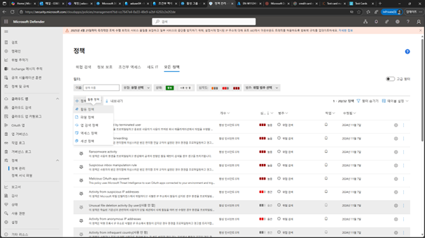
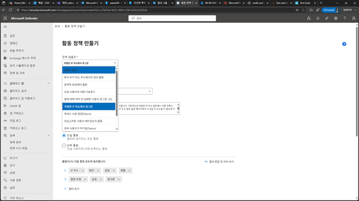
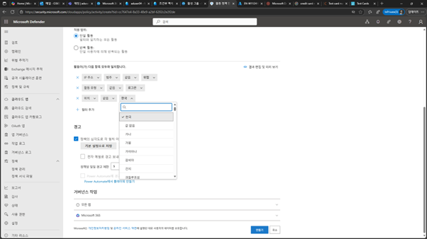
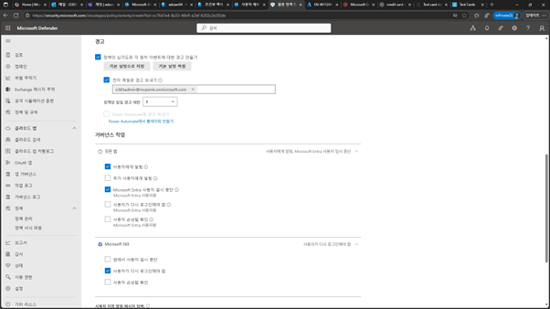
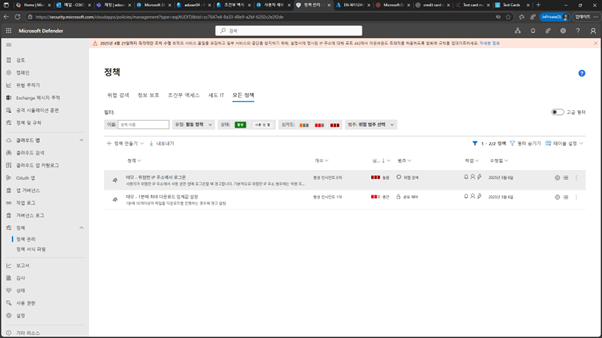
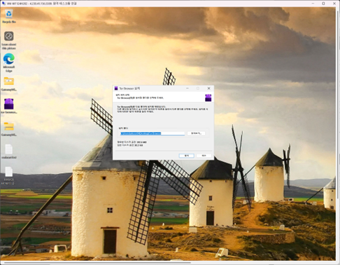
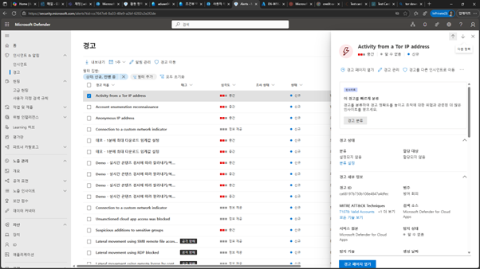

# 해외 IP 통해 로그인 접근 시 탐지 정책

1.	Microsoft Defender 포탈에서 [클라우드 앱] –[정책] 메뉴에서 [정책 만들기] – [활동 정책]을 클릭합니다. 
 

2.	활동 정책 만들기에서 [위험한 IP주소에서 로그온]을 선택합니다. 
 

 
3.	활동 조건에서 [IP주소-위험], [활동 유형 – 로그온], [위치 – 한국] 형태로 설정합니다. 
 

4.	경고 설정에서 사용자 및 관리자가 알림을 받도록 설정하고, [가버넌스 작업 – 사용자에게 알림/Microsoft Entra ID 일시 중단], [M365 – 사용자가 다시 로그인해야 함]을 설정 후 [만들기]를 클릭합니다. 
 

 
5.	생성한 정책이 정책 목록에 추가됩니다. 
 

6.	임의적인 해외IP에서 M365 접속 및 다운로드 테스트를 위하여 [Tor Browser]를 다운로드 합니다. 
 

 
7.	다운로드 받은 파일을 실행하여 Tor Browser를 설치합니다. 
 

8.	Tor Browser를 실행하고, M365 포탈 또는 앱(EXO,SPO,Onedrive,…)에 접속을 시도합니다. 
 

 
9.	Microsoft Defender 포탈의 [인시던트 & 알림] – [경고] 메뉴를 클릭하면, 설정된 정책에 의한 경고가 발생된 것을 확인할 수 있습니다. 
 
 
