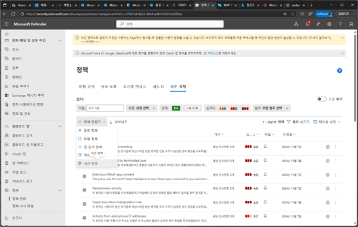
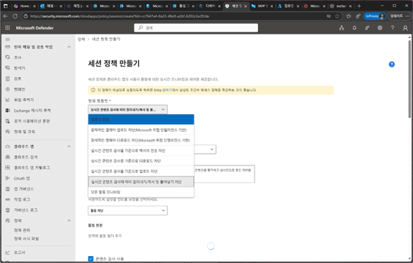
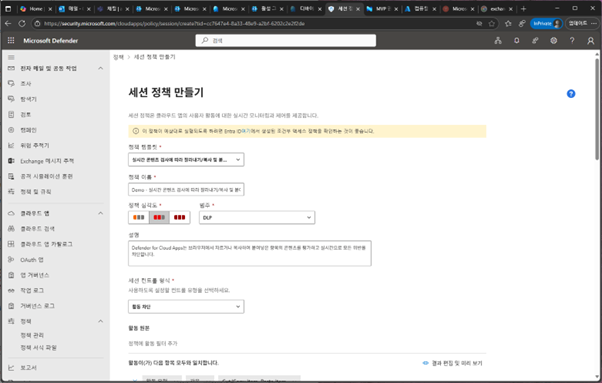
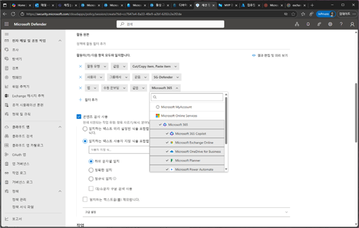
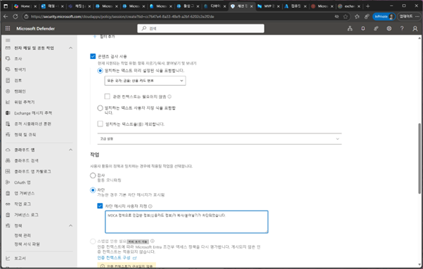
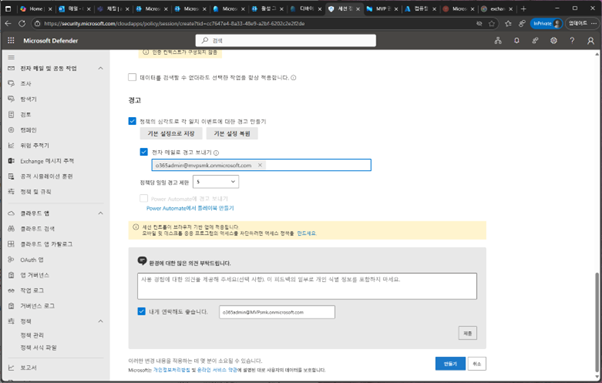
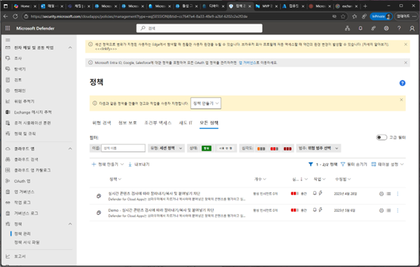
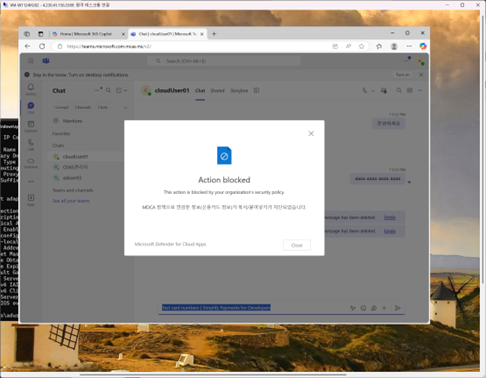
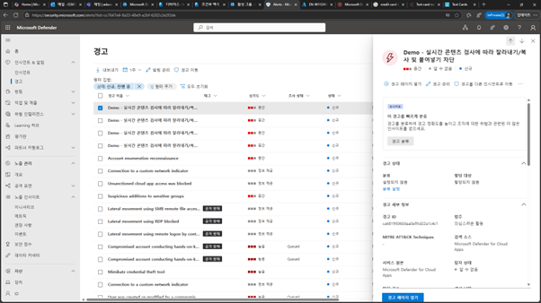
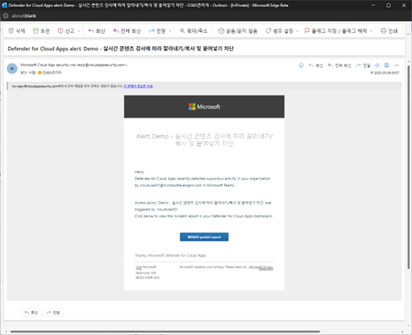

# 특정 정규식&키워드 복사/붙여넣기 차단

1.	Microsoft Defender 포탈에서 [클라우드 앱] –[정책] 메뉴에서 [정책 만들기] – [세션 정책]을 클릭합니다. 
 

2.	세션 정책 만들기에서 [실시간 콘텐츠 검사에 따라 잘라내기/복사…]를 선택합니다. 
 

3.	정책 이름과, 심각도, 범주, 설명등을 입력합니다. [세션 컨트롤 형식 – 활동 차단]을 선택합니다. 
 

4.	조건에 대한 부분을 [활동유형 – cut/copy,pastr..], [사용자 – 해당 그룹], [앱-M365]으로 지정합니다. 
 

5.	콘텐츠 검사 사용 부분에서 [일치하는 텍스트 미리 설정된 식 – 신용 카드번호]로 설정하고, 차단 메시지에 대한 내용을 지정합니다. 
 

6.	경고가 발생되면 사용자 및 해당 관리자의 이메일로 전송되도록 설정 후 [만들기]를 클릭합니다. 
 

7.	클라우드 앱 세션 정책이 추가됩니다. 
 

8.	다음 사이트에서 카번호드를 복사하여 Teams 채팅창에 붙여넣기를 시도 해봅니다. https://www.simplify.com/commerce/docs/testing/test-card-numbers  
 

9.	Microsoft Defender 포탈의 [인시던트 & 알림] – [경고] 메뉴를 클릭하면 경고 발생을 확인할 수 있습니다. 

 

10.	설정된 메일로 발생된 경고에 대한 내용을 이메일로 전송됩니다. 
 
