# 해외 IP 통해 파일 다운로드 시 탐지
1.	Microsoft Defender 포탈에서 [클라우드 앱] –[정책] 메뉴에서 [정책 만들기] – [세션 정책]을 클릭합니다. 
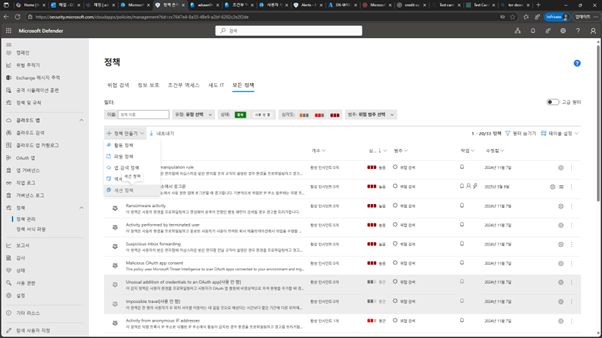
 

2.	세션 정책 만들기 화면에서 [실시간 콘텐츠 검사를 기준으로 다운로드 차단]을 선택합니다. 
 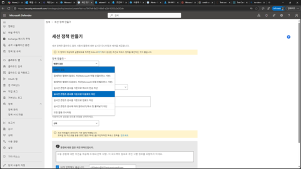

3.	[정책 이름],[심각도],[범주],[설명]을 입력합니다. 
 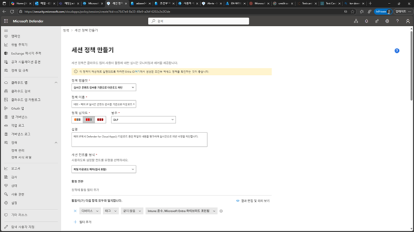

4.	조건에 대한 부분을 [사용자 – 해당 그룹], [위치-한국]으로 지정합니다. 
 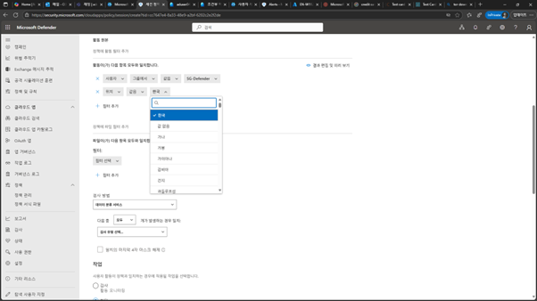
 

5.	작업 설정에서 [감사]로 설정하고, 경고 설정에 해당 이벤트에 대한 알림을 전송할 수 있도록 설정합니다. 
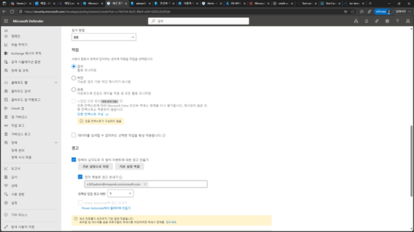
 

6.	클라우드 앱 세션 정책이 추가됩니다. 
 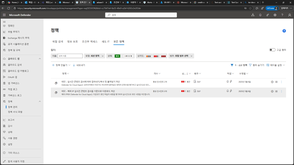

7.	임의적인 해외IP에서 M365 접속 및 다운로드 테스트를 위하여 [Tor Browser]를 다운로드 합니다. 
 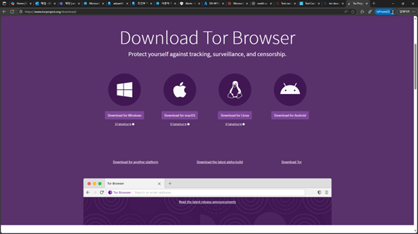

8.	다운로드 받은 파일을 실행하여 Tor Browser를 설치합니다. 
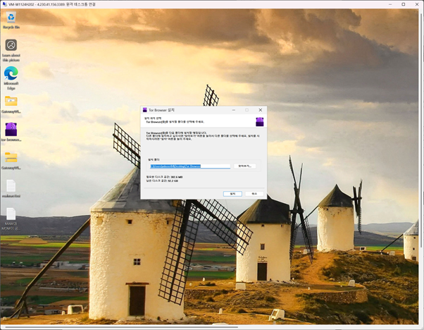

 
9.	Tor Browser를 실행합니다. 
 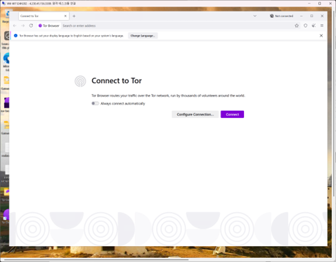

10.	다음과 같이 myip 사이트를 보면 실질적인 공인IP와 차이가 있는 것을 확인할 수 있습니다. 
 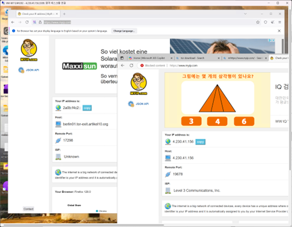

 
11.	Tor Browser를 실행하여 M365에 접속한 후 Onedrive/SPO등의 M365에서 저장되어 있는 파일을 다운로드를 시도합니다. 
 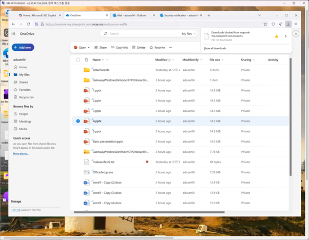

12.	Microsoft Defender 포탈의 [클라우드 앱] – [작업 로그]에서 다음과 같이 해외IP 대역에서 다운로드를 시도한 로그 정보를 확인할 수 있습니다. 
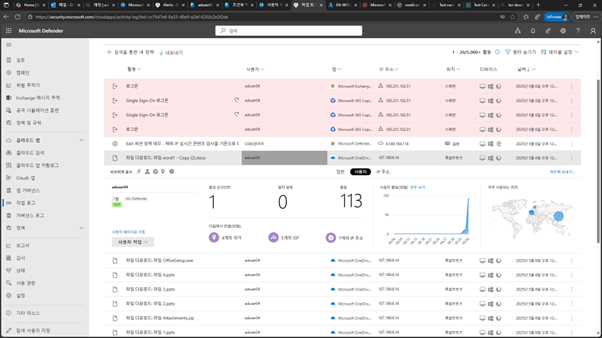
 
