# M365 앱에서 파일을 분당 최대 다운로드 임계값 설정 정책

1.	Microsoft Defender 포탈에서 [클라우드 앱] –[정책] 메뉴에서 [정책 만들기] – [활동 정책]을 클릭합니다. 
 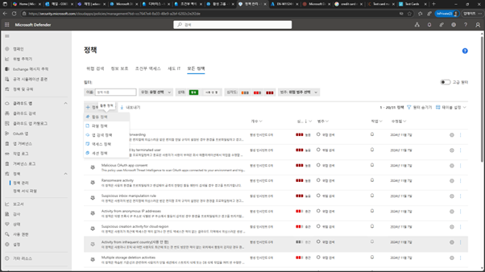

2.	활동 정책 만들기 화면에서 [정책 이름],[심각도],[범주],[설명]을 입력하고, 정책에 대한 필터 만들기에서 [반복 활동]에서 [최소 반복 활동], [기간내] 및 각 옵션에 대한 설정을 지정합니다. 
 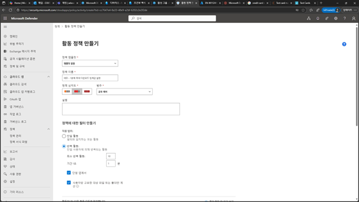

3.	활동에 대한 조건에서 [사용자/그룹], [앱-M365] ,[활동 유형 – 다운로드]를 설정합니다. 
 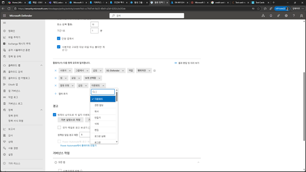

4.	경고 설정에서 사용자 및 관리자가 알림을 받도록 설정하고, [가버넌스 작업 – 사용자에게 알림/Microsoft Entra ID 일시 중단], [M365 – 사용자 손상 확인]을 설정후 [만들기]를 클릭합니다. 
 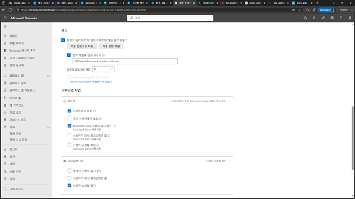

 
5.	생성된 정책이 목록에 추가 됩니다. 
 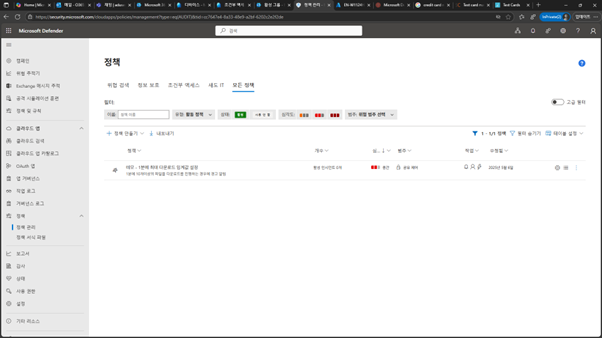

6.	해당되는 사용자 또는 그룹의 포함된 사용자로 파일을 1분안에 10개이상의 파일이 다운로드를 시도해봅니다.  

7.	Microsoft Defender 포탈의 [인시던트 & 알림]-[경고]에서 해당된 정책에 대한 경고 알림 메시지가 나열됩니다. 
 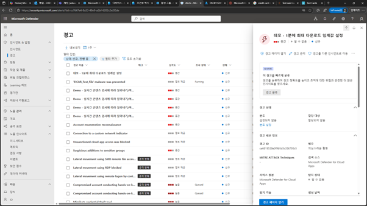

8. 가버넌스 설정으로 다음과 같이 해당되는 계정이 [사용 안함] 상태로 설정된 것을 확인할 수 있습니다. 
 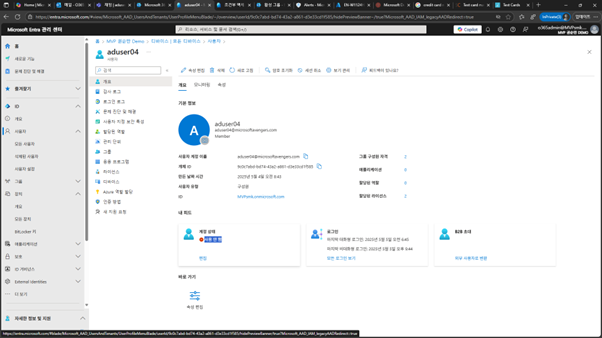

9.	로그인 되어 있었던 Teams 앱에서도 로그 오프된 상태가 됩니다. 
 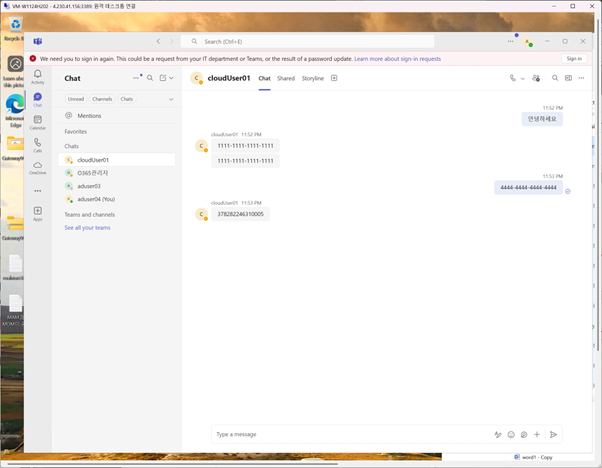

10.	M365 앱 또는 포탈을 시도하면 다음과 같이 액세스가 불가하다는 메시지가 발생됩니다. 
 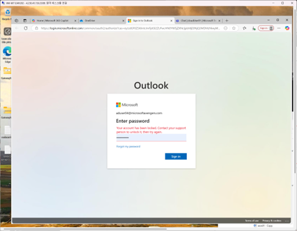

11.	발생된 경고에 대하여 알림 메일이 전송됩니다. 
 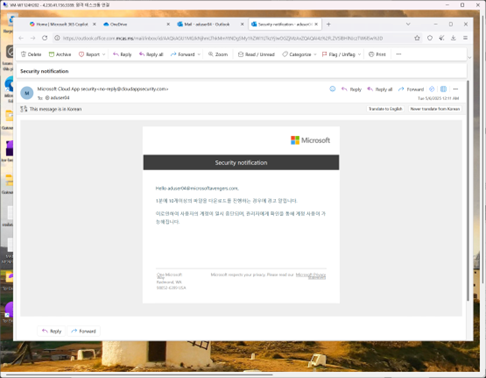

12.	관리자에게 다음과 같이 경고 알림 메시지 메일이 전송됩니다. 
 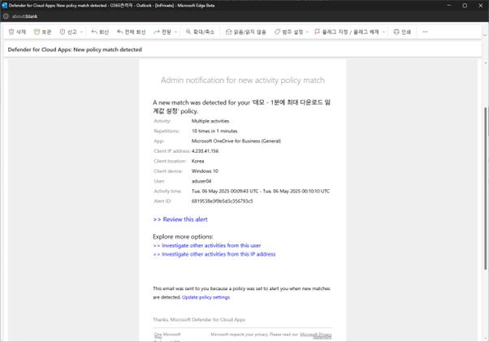

