# 소스코드 클라우드 업로드 차단
1.	Microsoft Defender 포탈에서 [클라우드 앱] –[정책] 메뉴에서 [정책 만들기] – [세션 정책]을 클릭합니다. 
 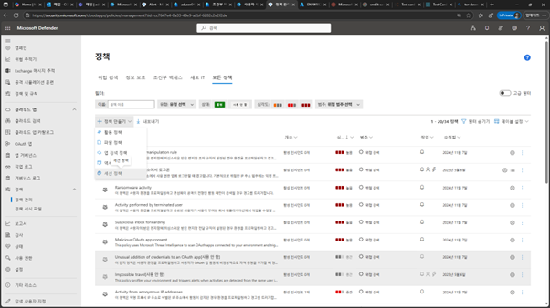

2.	세션 정책 만들기 화면에서 [실시간 콘텐츠 검사 기준으로 업로드 차단]을 선택하고, [정책 이름], [심각도],[범주],[설명]등을 입력합니다. 
 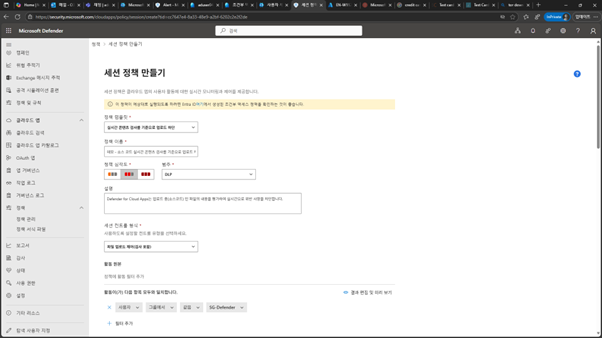

 
3.	검사 방법에서 [학습 가능한 분류자]를 선택합니다. 
 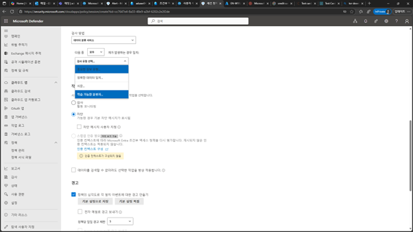

4.	학습 가능한 분류자 유형 선택에서 “source” 키워드를 입력한 결과에서 [Source Code]를 선택하고 [완료]를 클릭합니다. 
 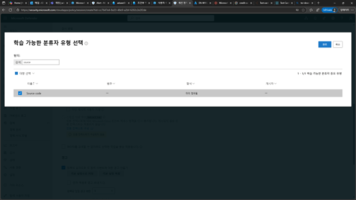

 
5.	작업에서 [차단] 및 [차단 메시지]를 입력합니다. 
 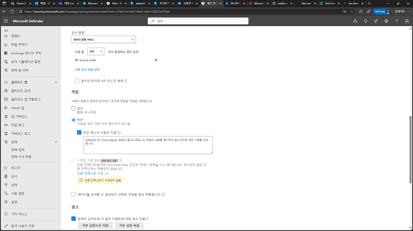

6.	경고에서 이벤트 발생에 따른 경고에 대한 메일을 받도록 설정하고 [만들기]를 클릭합니다. 
 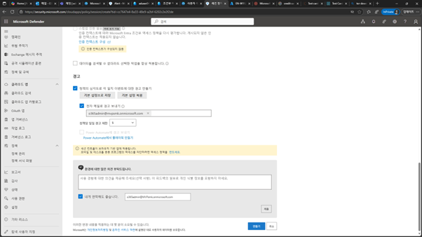

 
7.	생성한 정책이 목록에 추가됩니다. 
 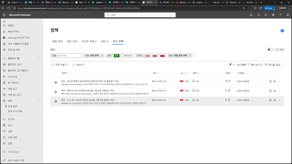

8.	다음 사이트에서 JAVA 소스 코드를 다운로드 받습니다. 
GitHub - HouariZegai/Calculator: Calculator app created with Java Swing, It is simple with an easy code to help novices learn how to operate a calculator.- https://github.com/HouariZegai/Calculator  

9.	다운로드 받은 파일의 압축을 해제한 후 Onedrive로 업로드를 시도합니다. 
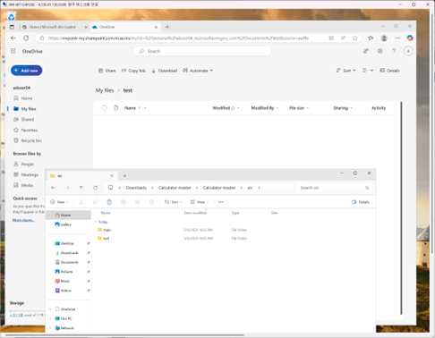

 
10.	설정한 정책에 의하여 차단된 메시지가 나타나면서 업로드가 차단됩니다. 
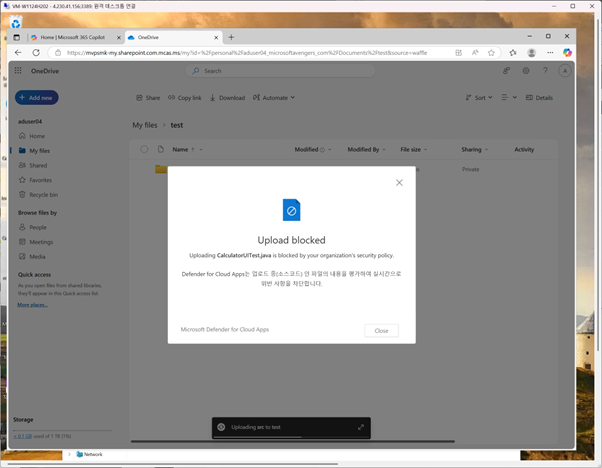

 

11.	Microsoft Defender 포탈의 [인시던트 & 알림] – [경고] 메뉴를 클릭하면 경고 발생을 확인할 수 있습니다. 
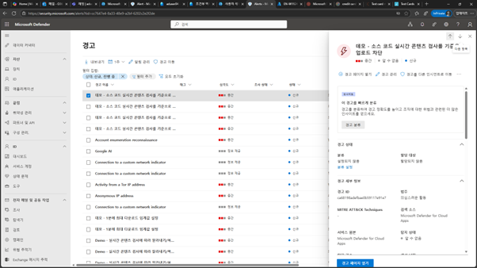

 
12.	Microsoft Defender포탈의 [클라우드 앱] –[작업 로그]에서도 관련된 차단된 결과에 대한 세부 사항을 확인 가능합니다. 
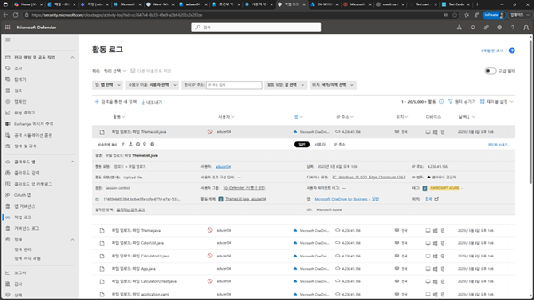
 

