# GenAI 사용 차단 정책

1.	Microsoft Defender 포탈의 [클라우드 앱] – [클라우드 앱 카탈로그]를 클릭하면 MDCA에서 설정에서 설정할 수 있는 클라우드 앱 목록들이 카테고리 형태로 나열됩니다. 
 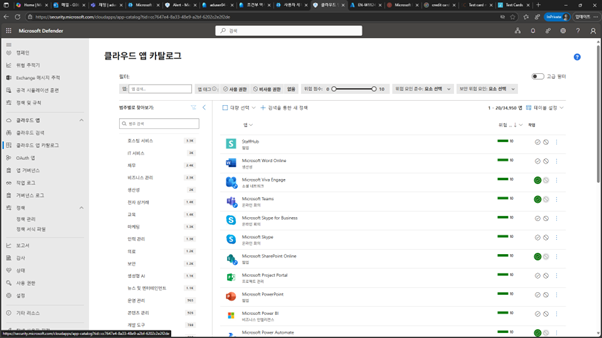

2.	범주별로 찾아보기에서 [생성형 AI]를 선택합니다. 
 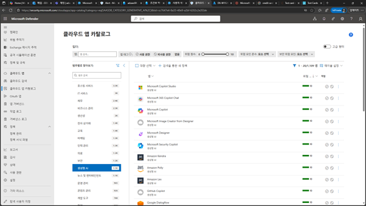

 
4.	MDCA로 관리할 수 있는 생성형 AI 앱 목록들이 나열되는 것을 확인할 수 있으며, 차단하고자하는 앱을 확인하고 […] –[비 사용 권한]으로 설정합니다.(여기서는 Gemini / OpenAI를 설정) 
 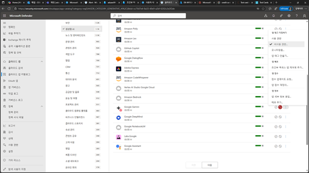

5.	설정된 앱은 빨강색 [비 사용] 아이콘으로 변경된 것을 확인할 수 있습니다. 
 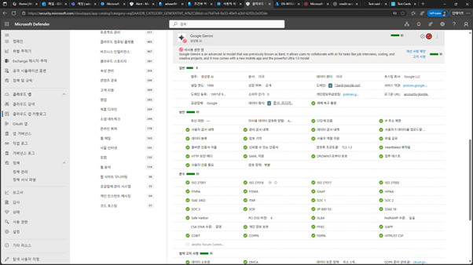

 
7.	Microsoft Defender 포탈에서 [설정] – [엔드포인트]를 클릭합니다. 
 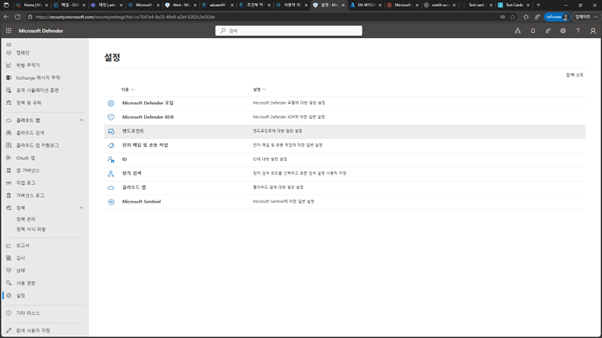

8.	엔드포인트 설정 화녀에서 [고급 기능] 메뉴에서 [사용자 지정 네트워크 표시기]와 [Microsoft Defender for Cloud App]을 설정한 후 [기본 설정 저장]을 클릭합니다. 
 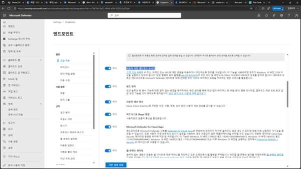
 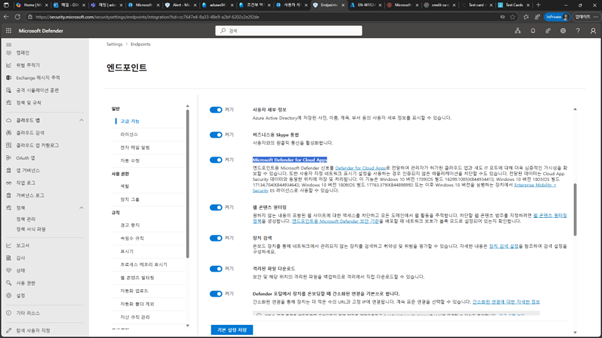

10.	약 몇분의 시간이 지난 후 엔드포인트 설정 화면에서 [규칙]-[표시기] 메뉴에서 [URL/Domain] 탭에서 앞에서 지정한 생성형 AI 앱의 URL 주소들이 자동으로 추가되는 것을 확인할 수 있습니다. 
 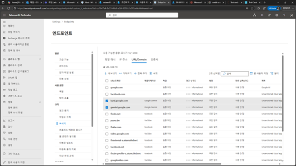

 
12.	Microsoft Defender 포탈에서 [설정] – [클라우드 앱]를 클릭합니다. 
 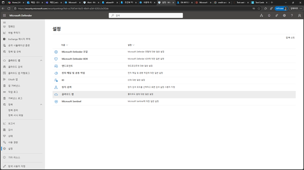

13.	클라우드 앱 설정에서 [클라우드 검색] – [엔드포인트 Microsoft Defender] 메뉴를 클릭하고 [엔드포인트 Microsoft Defender 통합]을 설정한 후 [저장]을 클릭합니다. 
 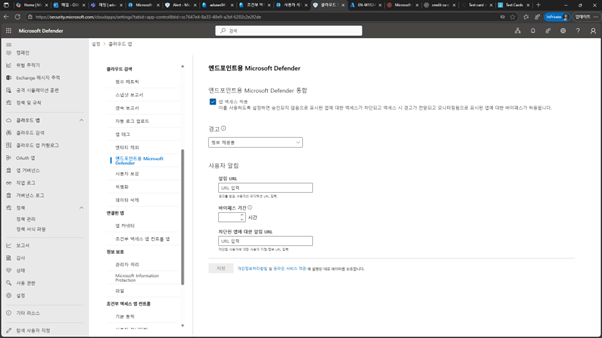
 

 
15.	다음과 같이 정책이 설정된 이후 해당되는 클라인트의 정책을 강제 싱크를 위하여 정책을 적용합니다. Windows의 [Setting] – [Account] –[Access Work and school]에서 설정되어 있는 계정에서 [Info]를 클릭하면 나타나는 화면에서 [Sync] 단추를 클릭합니다. 
 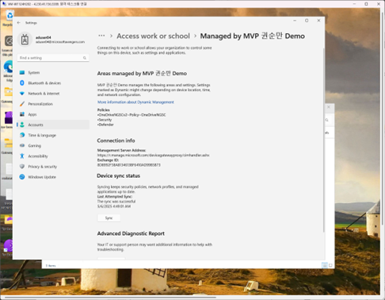

16.	정책이 정상적으로 배포되면, 다음과 같이 해당된 URL의 앱 사이트 접속이 제한됩니다. 
 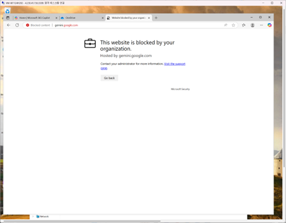

17.	유의사항으로 기본적으로 Edge 부분에서는 관련 정책이 적용이 되지만, 3rd 브라우저의 경우는(Chrome, Safari,Firefox,…) Intune에서 추가적인 정책을 생성해야 합니다.
Microsoft Intune 관리 센터에서 [엔드포인트 보안] –[바이러스 백신]에서 [+정책 만들기를]]를 클릭하고, [플랫폼-Windows], [프로필 – Microsoft Defender 바이러스 백신]을 선택 후 [만들기]를 클릭합니다. 
 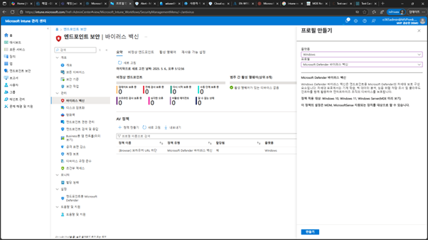

 
18.	정책 만들기 단계예서 [네트워크 보호 사용 – 사용(차단 모드)]를 설정하여 정책을 할당해야 합니다. 
 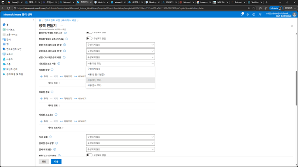

 

19.	Microsoft Defender 포탈의 [인시던트&알림] –[경고] 메뉴에서 해당되는 경고를 클릭하면 다음과 같이 특정 URL등이 차단되었다는 것을 확인할 수 있습니다. 
 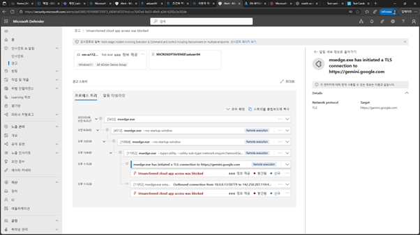

 
20.	추가적으로 MDCA에 나열되어 있는 생성형 AI 뿐아니라 이후에 추가적으로 개발될 수 있는 앱들에 대하여 보안하기 위하여 [클라우드 앱] –[클라우드 앱 카탈로그]메뉴를 클릭하고 [+검색을 통한 새 정책]을 클릭합니다. 
 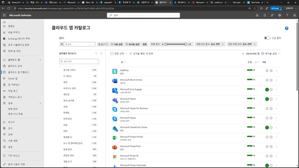

 
22.	앱 검색 정책 만들기 화면에서 [이름],[심각도],[범주],[설명]등을 입력하고, 조건에서 [범주-생성형 AI]를 선택합니다. 
 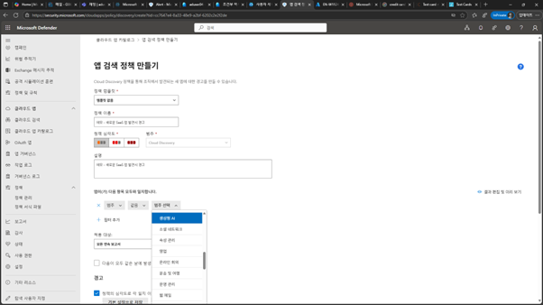 

23.	경고 설정에서 이벤트에 대한 경고 발생시 및 전송할 메일 주소를 입력한 후 [만들기]를 클릭합니다. 
 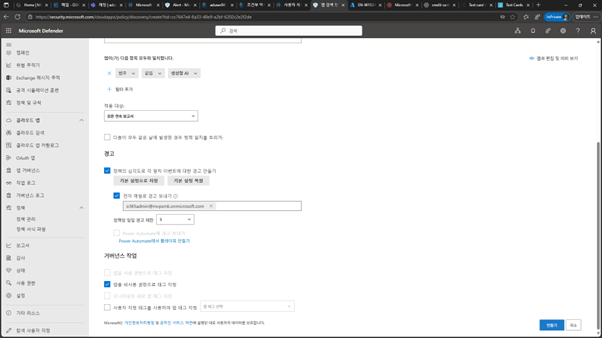

 
25.	생성된 정책이 정책 목록에 추가 됩니다. 
 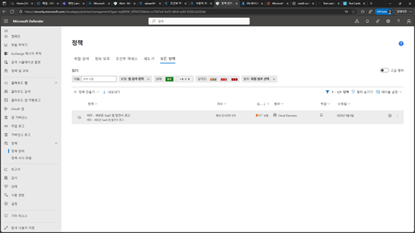

