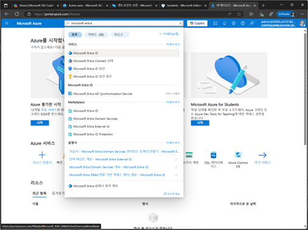
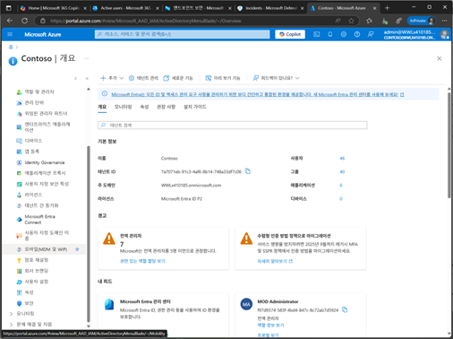
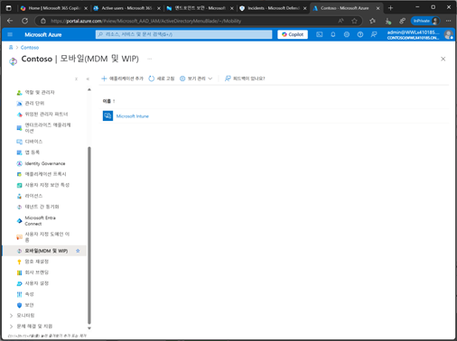
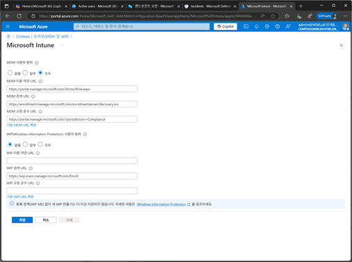
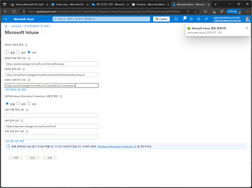

# 작업 1. MDE와 Intune 활성화 연결

방법 1. Azure 포탈에서 활성화 
1.	Azure portal에 접속하고, Microsoft Entra ID를 검색합니다.
 
 

2.	Entra ID 메뉴에서 [모바일(MDM 및 WIP) 메뉴를 클릭합니다.  
 

3.	모바일(MDM 및 WIP) 화면에서 [Microsoft Intune]을 클릭합니다. 
 

4.	Microsoft Intune 호면에서 MDM 사용자 범위를 [일부 또는 모두]를 설정한 후 [저장]을 클릭합니다. 
 

5.	Microsoft Intune을 통하여 MDM할 수 있는 설정이 완료됩니다. 
 
