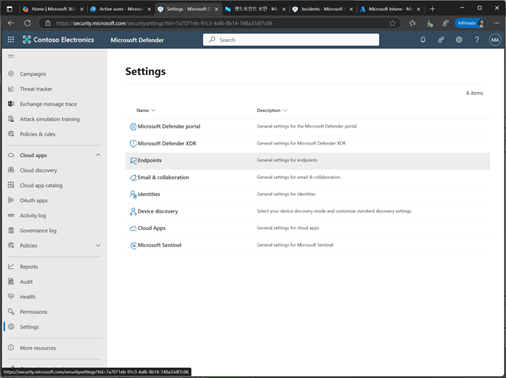
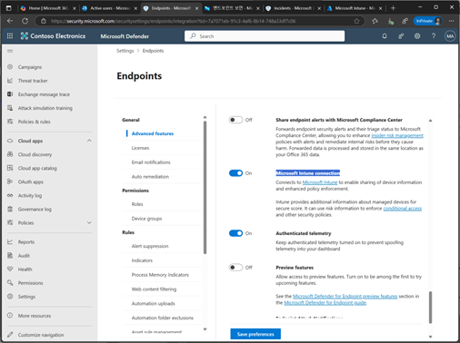
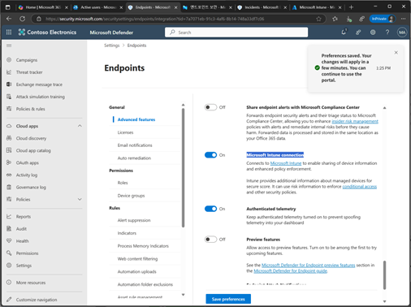
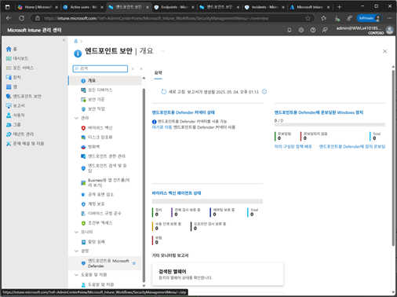
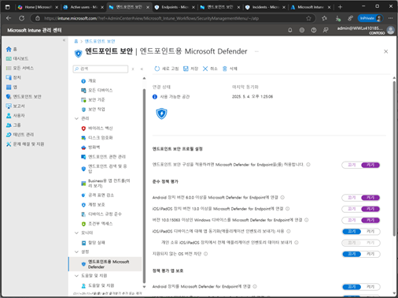
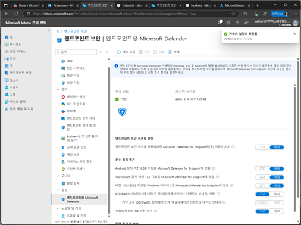

# 작업 1. MDE와 Intune 활성화 연결

방법 1. Azure 포탈에서 활성화 
1.	Azure portal에 접속하고, Microsoft Entra ID를 검색합니다.
 
 

2.	Entra ID 메뉴에서 [모바일(MDM 및 WIP) 메뉴를 클릭합니다.  
 

3.	모바일(MDM 및 WIP) 화면에서 [Microsoft Intune]을 클릭합니다. 
 

4.	Microsoft Intune 호면에서 MDM 사용자 범위를 [일부 또는 모두]를 설정한 후 [저장]을 클릭합니다. 
 

5.	Microsoft Intune을 통하여 MDM할 수 있는 설정이 완료됩니다. 
 

방법2. Microsoft Defender에서 설정

1.	Microsoft Defender 포탈 화면에서 [설정] – [Endpoint]를 클릭합니다. 
 

2.	Endpoint 설정 화면에서 [Microsoft Intune Connection]를 설정 하고 [저장]을 클릭합니다. 

 
3.	Microsoft Defender 포탈을 통하여 Intune 연결을 설정 완료합니다. 

 

방법3. Intune에서 MDE 연결

1.	Microsoft Intune 포탈화면에서 [엔드포인트 보안] 메뉴를 클릭합니다.  

 
2.	엔드포인트 설정 화면의 [설정] – [엔드포트인트용 Microsoft Defender]를 클릭하면 나타나는 화면에서 [엔드포인트 보안 프로필 설정]과 [준수 정책 평가] 부분을 설정한 후 [저장]을 클릭합니다. 

 

3.	Intune을 통하여 MDE 연동 설정을 완료합니다. 
 
