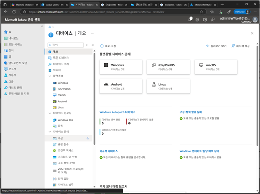
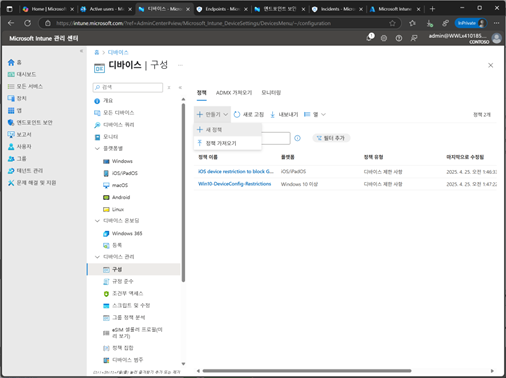
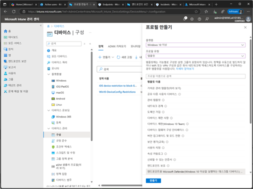
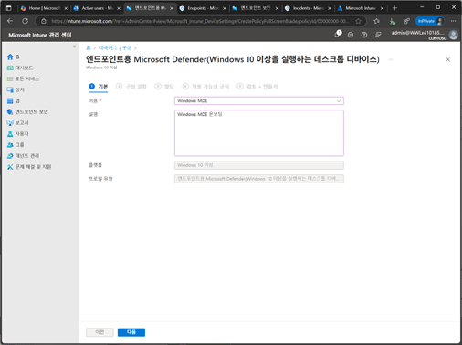
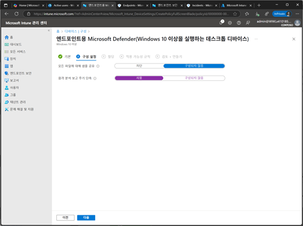
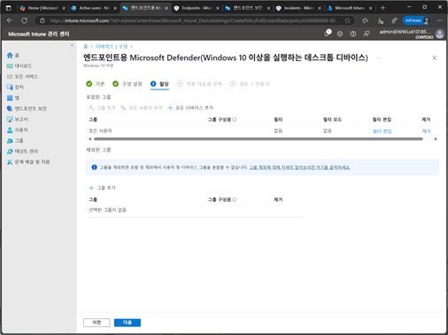
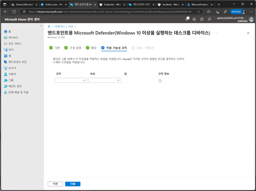
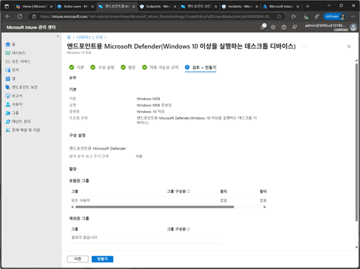

# 작업 2. Intune을 사용하여 디바이스 구성 프로필 생성
#### Intune에서 프로필을 생성할 때는 템플릿 옵션을 사용하는 것이 좋습니다. 이 오셥은 보안 기준 및 엔드포인트 보호 설정과 같은 특정 템플릿을 포함하고 있어, 디바이스를 효율적으로 온보딩하는데 도움이 됩니다.

1.	Intune 관리 센터에서 [디바이스 관리] – [구성]을 클릭합니다. 
 

 
2.	구성 화면에서 [정책] – [새 정책]을 클릭합니다. 

 

3.	프로필 만들기 화면에서 [플랫폼] / [템플릿]을 선택합니다. [엔드포인트 Microsoft Defender(Windows 10..)]을 선택하고 [만들기]를 클릭합니다. 

 

4.	프로필 [이름], [설명]을 입력합니다. 

 
5.	구성 설정 단계에서 다음과 같이 설정합니다. 

모든 파일 샘플 공유
이 설정은 MDE가 모든 파일의 샘플을 Microsoft로 공유할지 여부를 결정하며, 이를 통해 Microsoft는 잠재적인 위협을 분석하고 보안 기능을 개선할 수 있습니다. 
+ 사용안함 : 모든 파일의 샘플 공유가 차단되며, 디바이스에서 Microsoft 파일 샘플을 보내지 않습니다. 이 설정은 데이터 프라이버시를 강화할 수 있는지만, 잠재적인 위협 분석에 제한이 있을 수 있음
+ 구성하지 않음 : 기본 설정이 적용되며, 기본적으로 샘플 공유가 활성화될 수 있으며, 이는 Microsoft가 잠재적인 위협을 분석하는데 더 도움이 됨

테레미터리 보고서
MDE가 텔레메트리 데이터를 Microsoft로 보고하는 빈도를 조정합니다. 텔레메트리 데이터는 디바이스의 보안 상태와 관련된 정보를 포함합니다. 
+ 사용함 : 텔레메트리 보고 빈도가 증가합니다. 디바이스가 리스크한 상황일 경우에 더 자주 데이터를 Microsoft로 전송하여 보안 상태를 모니터링합니다. 이는 보안 위협을 더 빠르게 감지하고 대응하는데 도움이 됩니다.
+ 구성하지 않음 : 기본 설정이 적용되어 기본적으로 텔레메트리 보고 빈도가 표준 수준으로 유지됩니다.
 
 

6.	할당 단계에서 사용자 또는 그룹, 디바이스를 추가한 후 [다음]을 클릭합니다. 
 

7.	적용 가능한 규칙 단예서는 할당된 그룹 내에서 이 프로필을 적용하는 방법에 대하여 조건을 설정할 수 있습니다.  
 

8.	[검토+만들기] 단계에서 설정된 내용을 확인 후 [만들기]를 클릭하여 완료합니다.  
 
