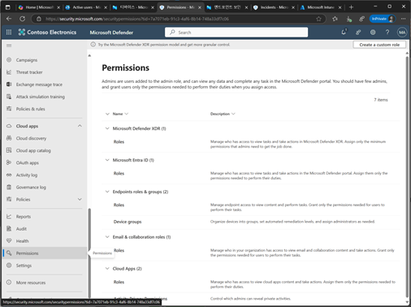
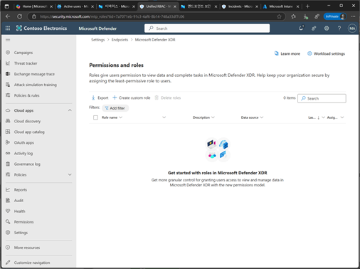
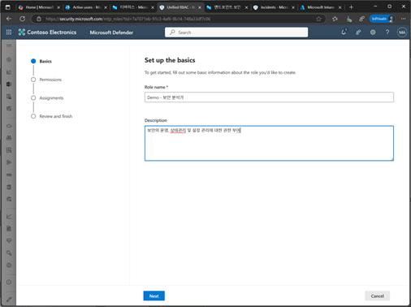
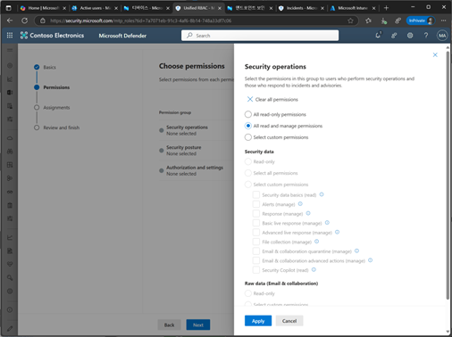
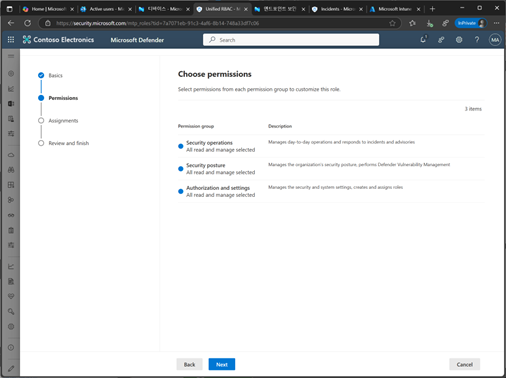
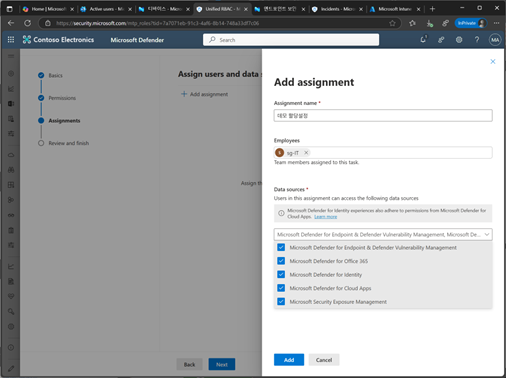
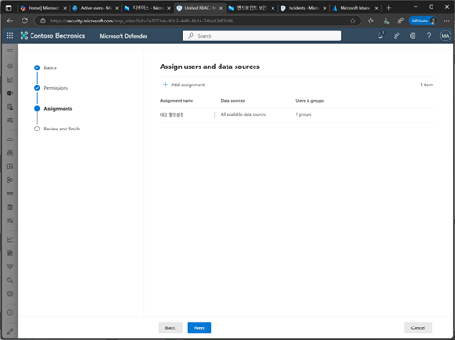
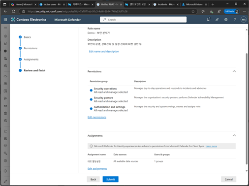
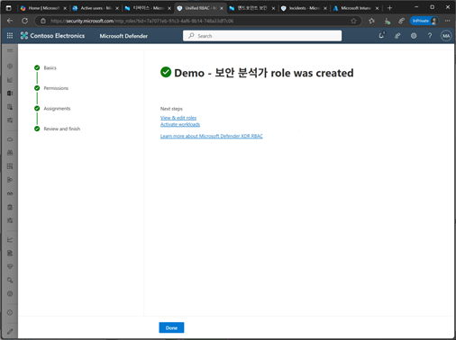
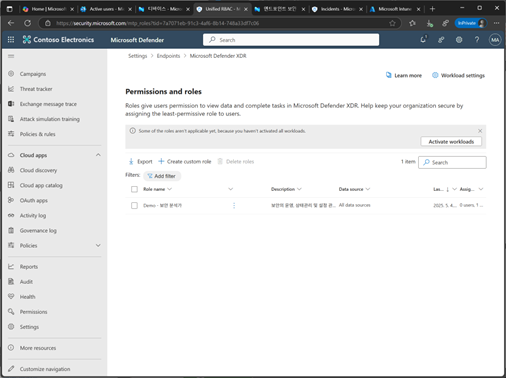

# 작업 3. RBAC 설정하기
#### RABC이란 특정 작업을 수행할 수 있는 자용자 제어, 사용자 정의 역할을 생성하고 세부적으로 Defender for Endpoint 기능에 대한 액세스를 제어합니다. 특정 장치 그룹 또는 그룹에 대한 정보보기제어를 통해 이름, 태그, 도메인 등 특정 기준에 따라 장치 그룹을 생성하고, 특정 Entra ID 사용자 그룹을 사용하여 역할 액세스를 부여 합니다. 

1.	Microsoft Defender 포탈 화면에서 [Permissions]을 클릭합니다. 
 

 

2.	Permissions and Roles 화면에서 [Create Customer role]을 클릭합니다.  
 

3.	기본 설정 화면에서 [이름], [설명]을 입력한 후 [Next]를 클릭합니다. 
 

4.	Permission 선택 화면에서 각 해당되는 Permissions 그룹의 설정값을 설정 적용 합니다.  
 

+ Security Operations : 일상적인 보안 운영을 관리하고 인시던트 및 경고에 대응합니다. 주로 보안 이벤트와 관련된 작업을 수행
+ Security posture : 조직의 보안 상태를 관리하고, Defender 평가를 수행하는 등의 작업을 담당합니다. 보안 정책의 준수 여부를 평가하고 개선
+ Authorization and settings : 보안 및 시스템 설정을 관리하며, 정책을 생성하고 관리합니다. 시스템의 전반적인 보안 설정

5.	각 Permission 그룹별로 설정을 완료 후 [Next]를 클릭합니다.  
  

6.	할당 설정 단계에서 할당할 [이름], [대상자] 및 [데이터 소스]를 선택한 후 [Add]를 추가 합니다.  
 

7.	할당된 사용자와 데이터 소스에 대한 부분을 설정이 추가된 것을 확인 후 [Next]를 클릭합니다. 
 

8.	Permission 설정 내용을 검토 후 [summit]을 클릭합니다.  
 

9.	Permission 설정이 생성이 완료된 메시지를 확인 합니다.  
 

10.	Permissions and Roles 목록이 나타납니다.  
 
