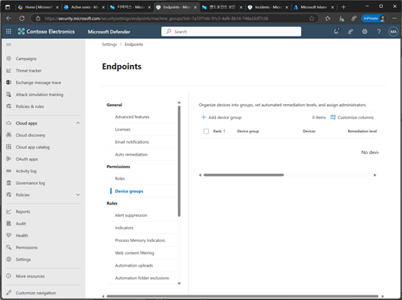
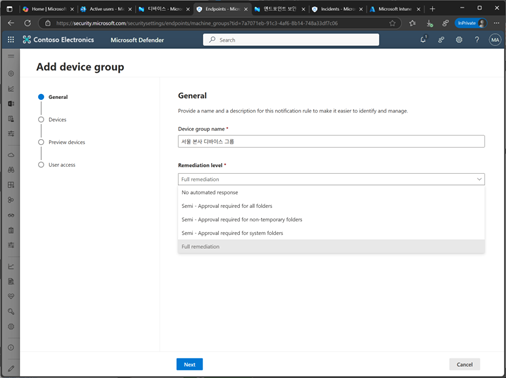
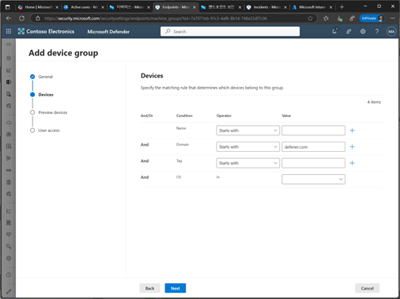
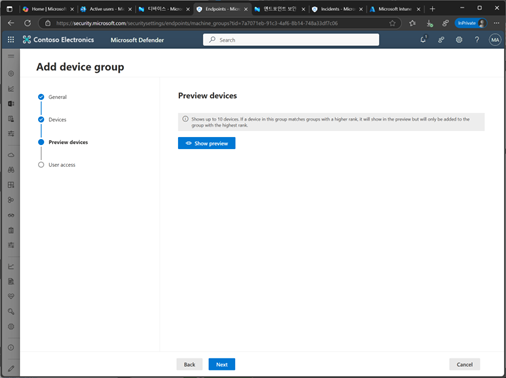
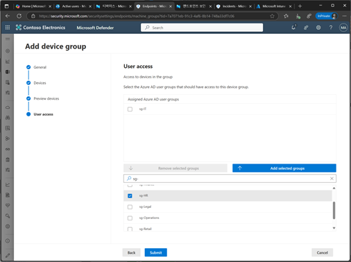
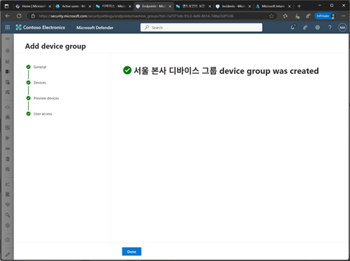
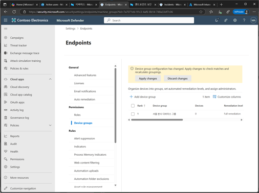

# 작업 4. 디바이스 그룹 생성하기
#### 디바이스 그룹이란 보안 운영팀의 책임을 논리적으로 분리하기 위해 사용됩니다. 장치 그룹을 생성하면 특정 기준(이름, 태그, 도메인등)에 따라 장치를 그룹화하고, 해당 그룹에 대한 역할 접근 권한을 부여할 수 있습니다. 이를 통해 특정 장치 그룹에 대한 보안 정책을 적용하고, 다양한 설정(예, 웹 콘텐츠 필터링, 억제 규칙, 정책 기준선등)을 적용할 수 있습니다. 

1.	Microsoft Defender 포탈화면에서 [설정] – [Endpoint]의 [Device 그룹]을 클릭합니다.  
 
 
2.	디바이스 그룹 생성 일반 단계에서 [디바이스 그룹 이름]과 [위협 처리를 위한 기준]을 선택합니다.  
+ No automated response(자동 응답 없음)
+ Semi – Require approval for all folders(모든 폴더에 대해 승인 필요)
+ Semi – require approval for non-temp folders(임시 폴더가 아닌 폴더에 대해 승인 필요)
+ Semi – require approval for core folders(핵심 폴더에 대해 승인 필요)
+ Full – remediate threats automatically(완전 자동으로 위협 해결)  
 

3.	디바이스 그룹에 대한 조건을 추가하는 설정에서 조건을 선택 한 후 [Next]를 클릭합니다.
조건 조합(AND/OR) 입니다. AND는 각 조건중 일부 조건을 비워두면 해당 조건을 무시됩니다. OR는 오른쪽 “+”버튼을 클릭하여 새로운 조건을 추가하는 경우의 조건입니다. 
 

 
4.	조건을 결과에 해당되는 디바이스 목록을 확인할 수 있습니다.  

 
5.	사용자 접근 설정 부분에서 특정 장치 그룹에 접근할 수 있는 사용자와 Entra ID 그룹을 선택할 수 있으며, 이를 통해 다음과 같은 기능을 제공합니다. 
+ 특정 사용자 및 그룹에 대한 접근 권한 부여 : 특정 사용자 Entra ID그룹을 선택하면, 선택된 사용자와 그룹만 해당 장치 그룹에 접근할 수 있고, 선택되지 않은 사용자는 해당 장치 그룹에 접근할 수 없습니다. 
+ 티어링 모델 유지 : 이 기능은 티어링 모델을 유지하는데 매우 유용하며, 예로 도메인 컨트롤러만 포함된 장치 그룹을 생성하고, 티어0 관리자만이 장치들에 접근할 수 있도록 설정할 수 있습니다.  
 

 

6.	디바이스 그룹 생성이 완료된 메시를 확인합니다.  
 

7.	디바이스 그룹 목록을 확인할 수 있습니다.  
 
