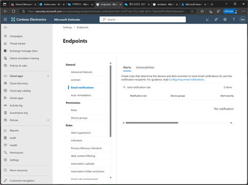
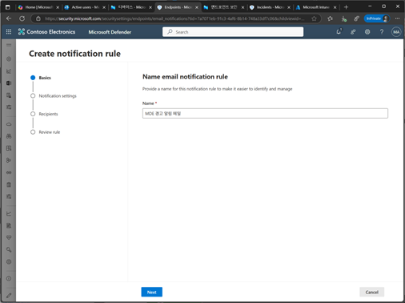
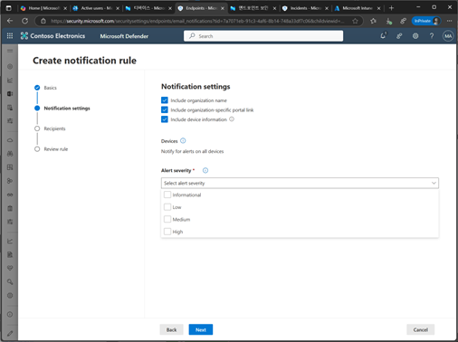
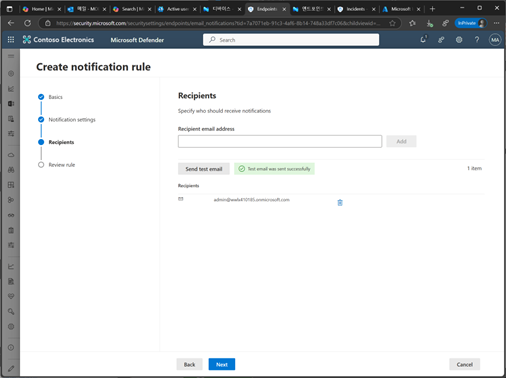
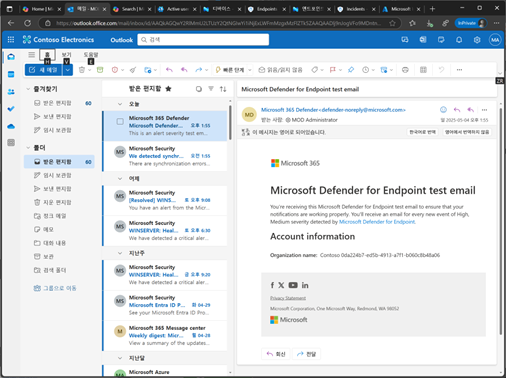
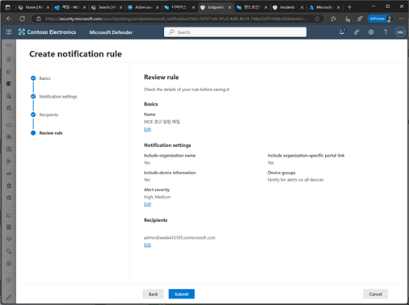
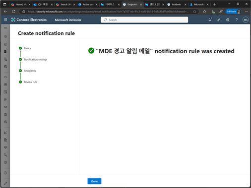
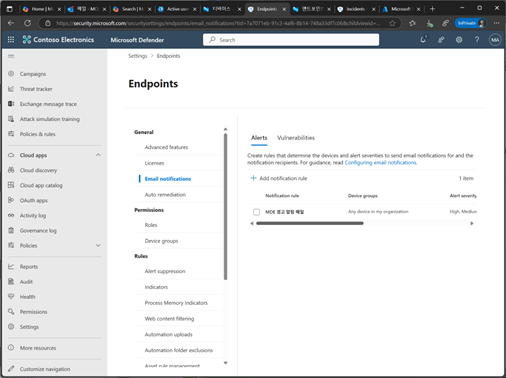

# 작업 5. 알림 메일 설정하기
#### 설정된 경고등이 발생되면 해당되는 사용자에게 알림 메일을 전송할 수 있습니다. 

1.	Microsoft Defender 포탈화면에서 [설정] – [Endpoint] 설정화면에서 [Email notifications]에서 [Add notification rule]를 클릭합니다.  
 

 
2.	알림 규칙에 대한 [이름]을 입력합니다. 
 

3.	알림 규칙에 대한 설정을 진행하고, 알림의 민감도 부분의 레벨을 선택합니다. 
 

 
4.	알림을 받게될 사용자의 이메일을 입력하고 [Send test email]을 클릭하여 정상 수신 여부를 체크합니다.  
 

5.	테스트한 메일이 다음과 같이 수신됩니다. 
 

6.	알림 규칙 설정에 대한 내용을 확인후 [Summit]을 클릭합니다.  
 

7.	MDE 경고 알림 메일을 완료된 메시지를 확인합니다. 
 

 
8.	MDE 메일 알림 규칙 목록이 추가됩니다. 
 

