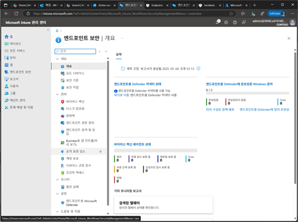
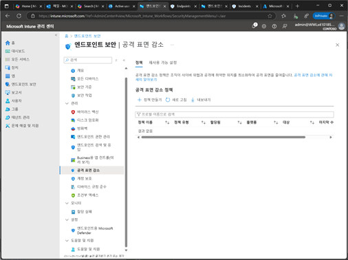
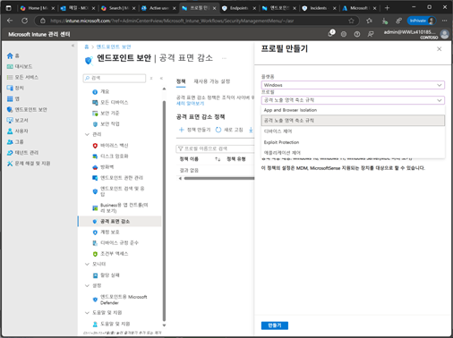
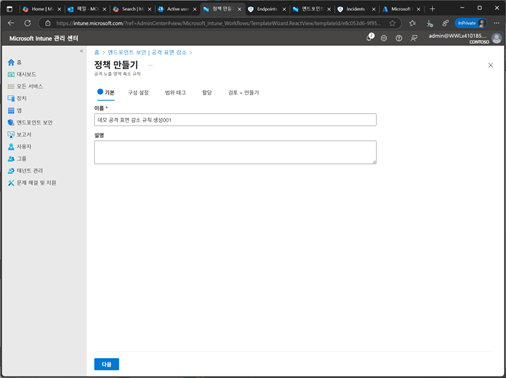
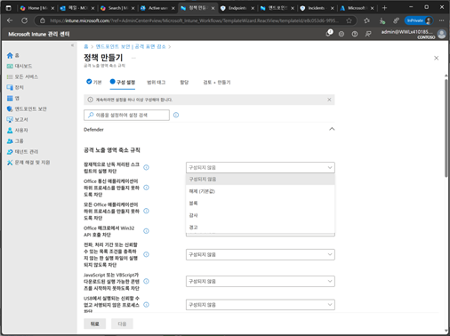
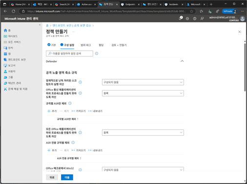
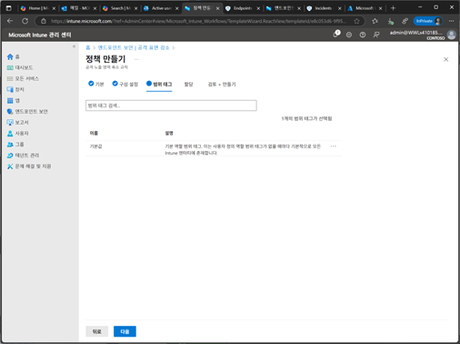
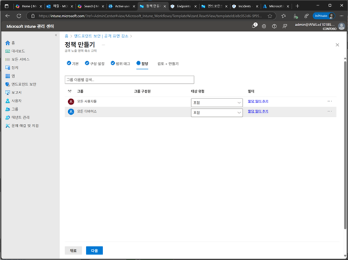
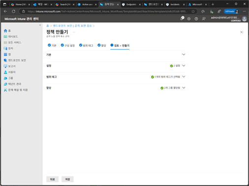
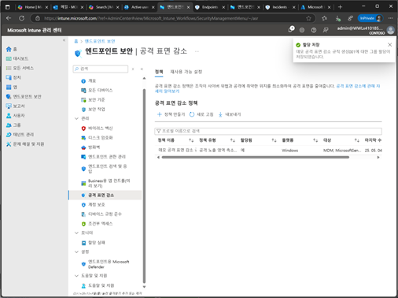

# 작업 6. 공격표면 감소 설정(Attack surface reduction)

#### 공격표면 감소 규칙은 외부 시점에서 보안 취약점을 식별하고 이를 강화하는데 목적이 있으며, 예를 들어 특정 장치에서 보안 취약점이 발견되면, ASR 규칙을 통해 다양한 보안 조치로 보안 취약점을 감소시켜 공격 표면을 줄이는 방법입니다. 

1.	Microsoft Intune 관리 포탈에서 [엔드포인트 보안] 메뉴를 클릭합니다.  
 

 
3.	공격 표면 감소 메뉴에서 [정책 만들기]를 클릭합니다 . 
 

4.	프로필 만들기 화면에서 [플랫폼]를 선택하고, 프로필에서 [공격 노출 영역 축소 규칙]을 선택하여 [만들기]를 클릭합니다 
 

5.	정책 만들기 화면에서 [이름], [설명]을 입력합니다. 
 

6.	구성 설정 단계에서 나열되어 있는 공격 노출 영역 축소 규칙 중에서 설정을 진행합니다. 
 

7.	규칙에서 [블록]을 설정하면 해당되는 규칙에 대해서 추가 제외할 수 있는 부분을 설정할 수 있습니다  
 

8.	범위 태그를 입력합니다.  
 

9.	할당 단계에서는 해당되는 ASR 규칙을 적용할 대상자를 추가합니다.  
 

10.	검토+만들기 단계에서는 설정된 ASR 정책을 호가인후 [저장]을 클릭하여 생성합니다. 
 

11.	공격 표면 감소 정책이 생성되고, 정책들이 나열됩니다.  
 

