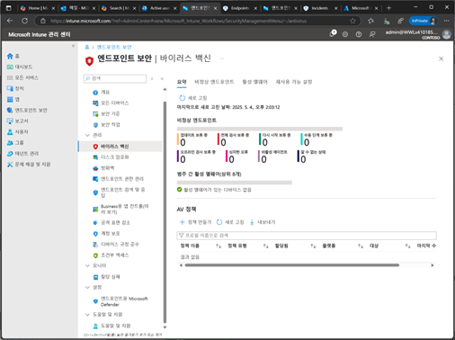
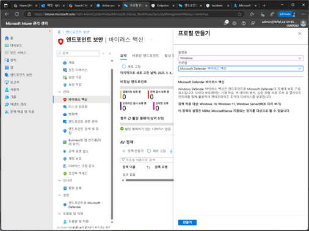
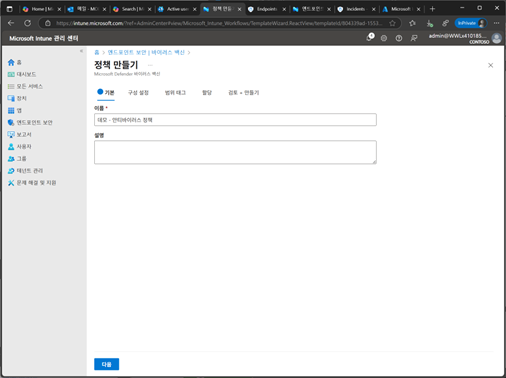
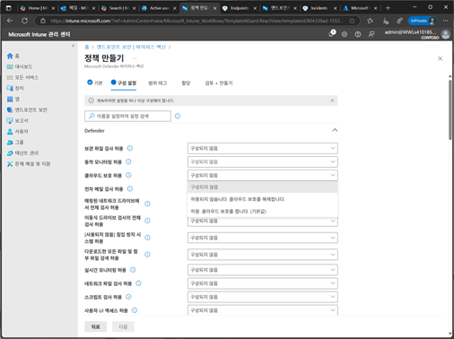
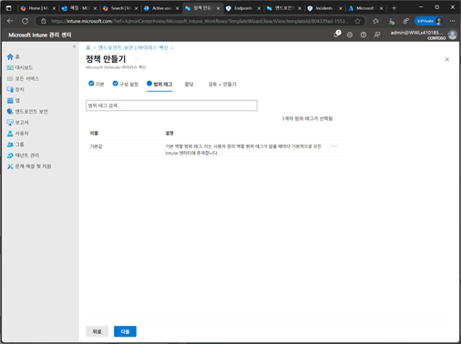
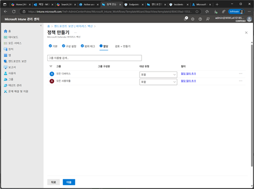
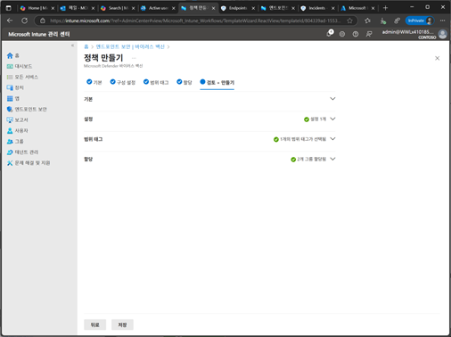
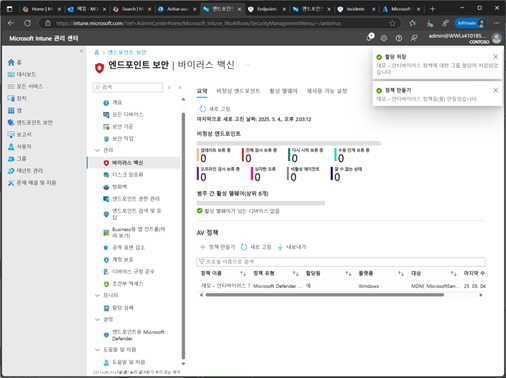

# 작업 7. 안티 바이러스 설정

1.	Microsoft Intune 포탈에서 [엔드포인트 보안] – [바이러스 백신]을 클릭합니다.  
 

2.	프로필 만들기에서 [플랫폼] / [템플릿 – Microsoft Defender 바이러스 백신]을 선택하고 [만들기]를 클릭합니다.  
 

3.	정책 만들기 단계에서 [이름], [설명]을 입력합니다  
 

4.	구성 설정 단계에서 안티 바이러스를 위한 설정등을 선택 설정합니다.  
 

 
5.	범위 태그 단계에서 관리하려는 태그를 지정합니다. 
 

6.	할당 단계에서 안티바이러스 정책을 적용할 대상자를 추가합니다.  
 

 
8.	검토+만들기 단계에서 설정된 안티바이러스 설정 내용을 확인 후 저장 합니다. 
 

9.	안티 바이러스 정책이 목록에 추가됩니다. 
 
