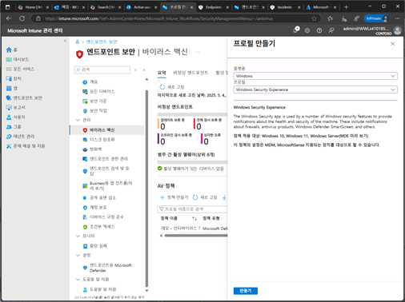
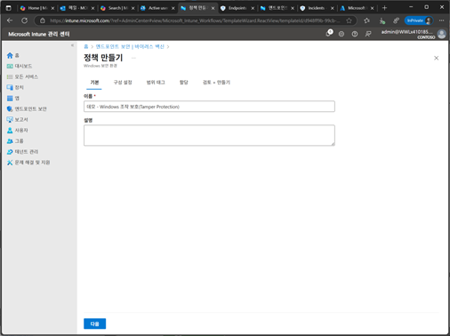
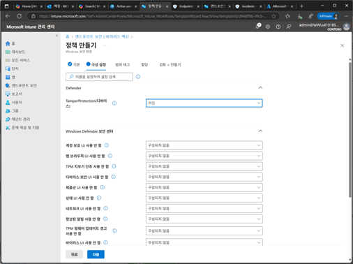
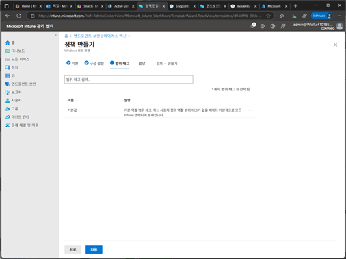
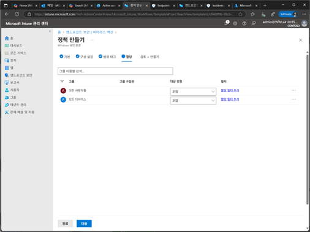
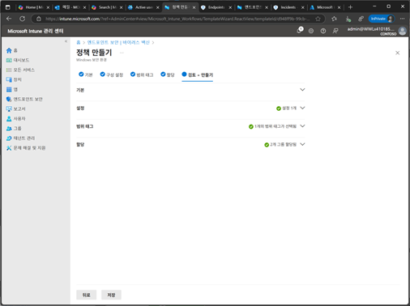
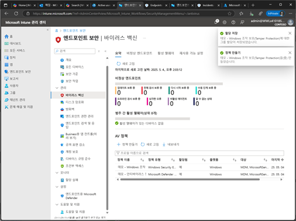

# 작업 8. Tamper Protection(조작 보호)설정하기
#### Tamper Protection은 바이러스 및 위협 보호 설정이 비활성화되거나 변경되는 것을 방지합니다. 이 기능은 사이버 공격중에 악의적인 행위자가 보안 기능을 비활성화하려는 시도를 막아 줍니다. Tamper Protection이 켜져 있을 때는 설정 변경이 불가능하며, 변경시도는 차단됩니다. 

1.	Microsoft Intune 관리 센터에서 [엔드포인트 보안] –[바이러스 백신]에서 프로필을 생성합니다. [플랫폼 – Windows], [Windows Security Enterprise] 선택 후 [만들기]를 클릭합니다.  
 

 
2.	정책 만들기 단계에서 [이름], [설명]을 입력합니다  
 

3.	구성 설정 단계에서 Tamper Protection을 [켜짐]을 설정합니다.  
 

 
4.	범위 태그 단계에서 관리하려는 태그를 지정합니다. 
 

5.	할당 단계에서 안티바이러스 정책을 적용할 대상자를 추가합니다.  
 

 
6.	검토+만들기 단계에서 설정된 안티바이러스 설정 내용을 확인 후 저장 합니다. 
 

7.	안티 바이러스 정책이 목록에 추가됩니다. 
 
