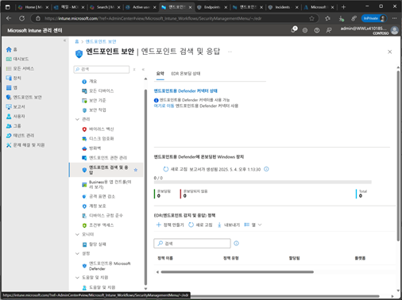
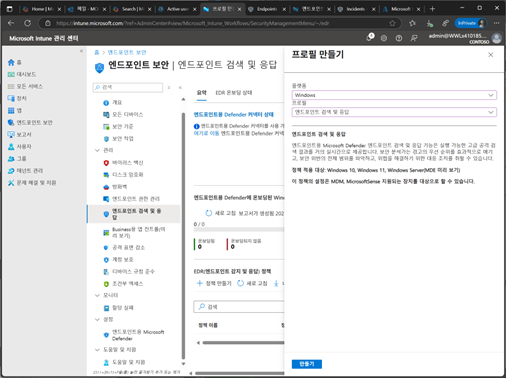
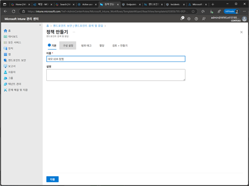
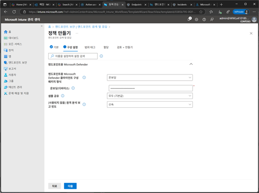
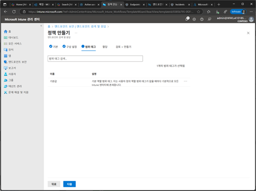
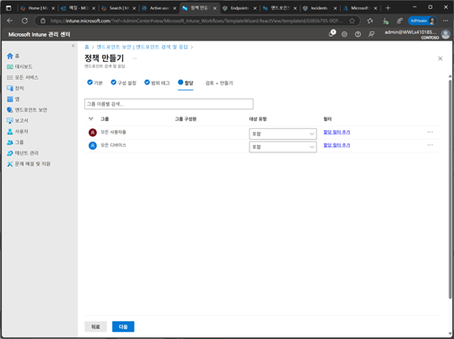
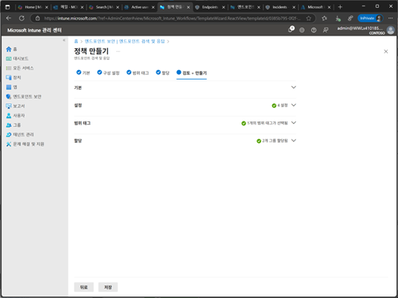
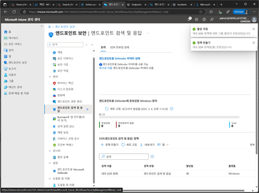

# 작업 9. Defender EDR(Endpoint detection &response) 설정

1.	Microsoft Intune 관리센터에서 [엔드포인트 보안] – [엔드포인트 검색 및 응답]에서 [정ㅊ책 만들기]를 클릭합니다. 
 

2.	프로필 만들기에서 [플랫폼-Windows] / [엔드포인트 검색 및 응답]을 선택합니다. 
 

3.	정책 만들기 기본 단계에서 [이름], [설명]을 입력합니다. 
 

4.	구성 설정에서 MDE에서 설정을 지정합니다. 
+ MDE Client configuration package type : MDE 패키지는 MDE를 설정하고 구성하는데 필요한 모든 파일과 설정을 포함하며, 기본적으로 설정되지 않음으로 표시되며, 필요에 따라 적절한 패키지 선택하여 구성합니다. 
+ Sample Sharing : 샘플 공유 설정으로 MDE가 악성 샘플을 Microsoft 전송하도록 허용할지에 대한 여부를 결정합니다. Not Configured는 Intune에서 해당 설정ㅇ을 변경하지 않으며, 장치에 적용된 기본값이 유지됩니다. 즉 조직의 정채에 따라 샘플 공유가 활성화되거나 비활성화 될 수 있습니다. Non은 MDE가 악성 샘플을 Microsoft로 전송하지 않도로 명확하게 지정합니다.
+ Telemetry Reporting Frequency : MDE가 원격 측정 데이터를 Microsoft로 전송하는 빈도를 지정합니다. 원격 측정 데이터는 제품 성능, 사용 현황 및 잠재적인 문제를 분석하는데 사용됩니다.  
 

5.	범위 태그를 지정합니다.  
 
 
6.	할당 단계에서 해당하는 정책에 대한 그룹을 지정 설정합니다.  
 

7.	검토+만들기 단계에서 설정된 내용을 확인 후 [저장]을 클릭합니다.  
 
 
8.	엔드포인트 검색 및 응담 정책이 생성되고 나열됩니다. 
 

