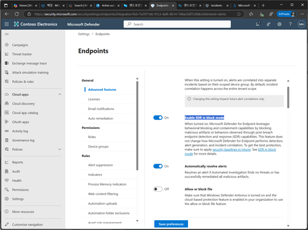

# 작업 10. EDR 블록모드 설정하기
#### EDR 블록 모드란 주요 목적은 타사 바이러스 백신 제품에서 누락된 위반 후 검색을 수정하는 건입니다. 이 모드는 EDR 기능이 탐지한 악성 아티팩트를 차단하고 수정하는 역할을 하며, 예를 들어 기본 안티바이러스 제품이 탐지하지 못한 아티팩트를 EDR이 탐지하면, EDR블록 모드가 이를 수정합니다. 블록 모드의 EDR은 사용자의 디바이스에서 실행되는 타사 바이러스 백신 보호에 영향를 주지 않습니다. 블록 모드의 EDR은 기본 바이러스 백신 솔루션이 무언가를 놓치거나 위반 후 검색이 있는 경우 동작하게 됩니다. 

Microsoft Defender 포탈에서 [설정] – [Endpoint]의 [Advanced features] 메뉴에서 [Enable EDR in block mode]를 설정하고 저장합니다.  
 
