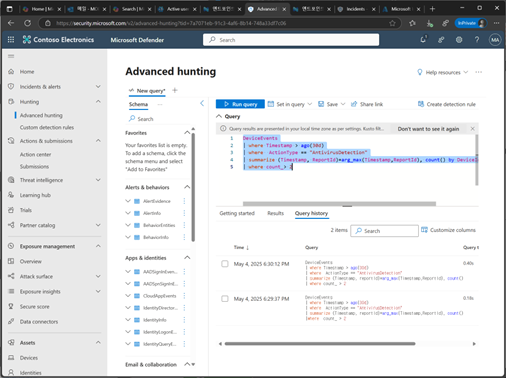
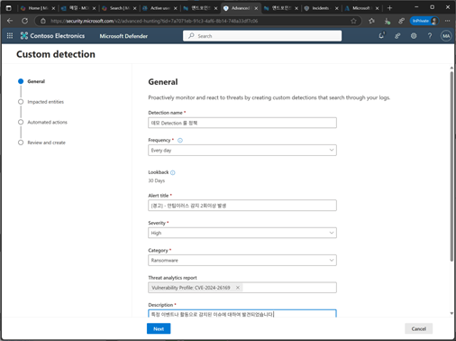
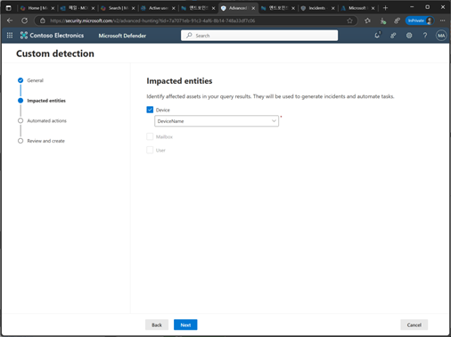
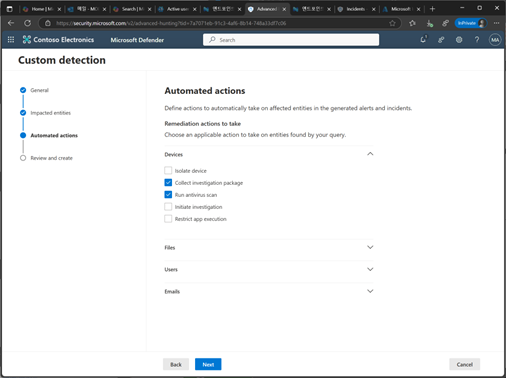
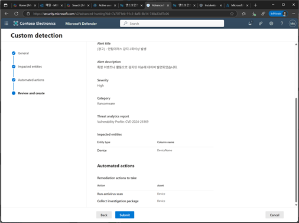
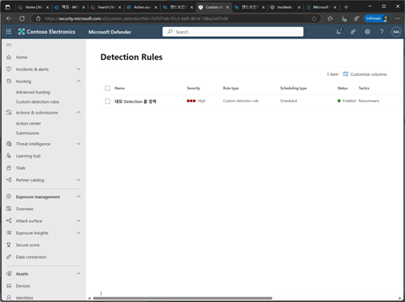

# 작업 11. 헌팅 쿼리로 Detection 룰 설정하기
#### Detection 룰이란, 보안 시스템에서 특정 이베니트나 활동을 감지하고 경고를 생성하기 위해 설정하는 규칙 입니다. 이러한 규칙은 보안 위협을 조기에 발견하고 대응할 수 있도록 도움을 줍니다. 

1. Microsoft Defender 포탈에서 [Hunting] –[Advanced hunting]을 클릭하고, KSQL를 입력 실행하고 왼쪽 상단에서 [Create detection rule]를 클릭합니다. 
 

 
2. Custom detection 일반 단계에서 [Detection 이름], [주기],[알림 타이틀], [민간도], [카테고리], [위협 분석 보고], [설명],… 내용을 설정 및 입력합니다. 
 

3. Impacted entities 단계에서 감지된 이벤트가 영향을 미치는 장치를 식별하기 위해 사용되는 부분을 설정합니다. 선택한 엔티티를 통하여 이벤트를 추적하고 분석할 수 있게됩니다. 
 

4. Automated action 단계에서 쿼리에서 발견된 엔터티에 대해 적용할 수 있는 조치를 선택하고, 설정된 감지된 위협에 대해 자동으로 취할 조치를 정의할 수 있게 됩니다.  
+ Collect investigation package : 조사 패키지를 수집하여 장치에서 추가적인 데이터를 수집하여 심층분석을 수행하는데 사용
+ Run Antivirus scan : 안티바이러스 검사를 실행하여 감염된 장치에서 악성 소프트웨어를 탐지하고 제거
+ Isolate device : 장치를 격리하여 감염된 장치가 네트워크에서 다른 장차로 위협을 전파하지 않도록 설정
+ Initiate investigation : 조사를 시작하여 감지된 위협에 대한 심층적인 조사를 수행
+ Restrict app execution : 애플리케이션 실행을 제한합니다. 감영된 장치에서 특정 애플리케이션의 실행을 제한하여 추가적인 위협을 방지 
 

 
5. 설정된 Detection 정책 내용을 확인하고 [Summit]을 클릭합니다. 
 

6.	Detection Rule 목록에 추가됩니다. 
 