1.	Server Manager를 실행한 화면레서 [Add Roles and Features]를 클릭하고, Before you begin 화면에서 [Next]를 클릭합니다.

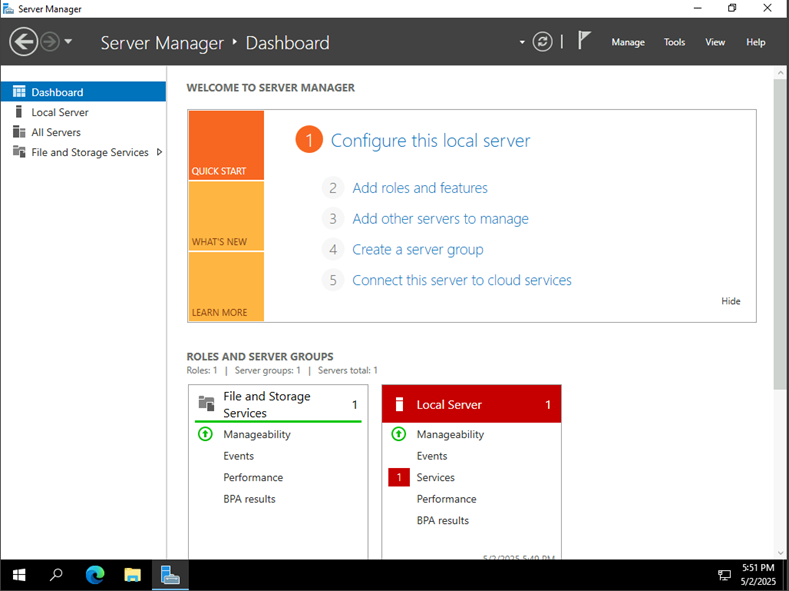

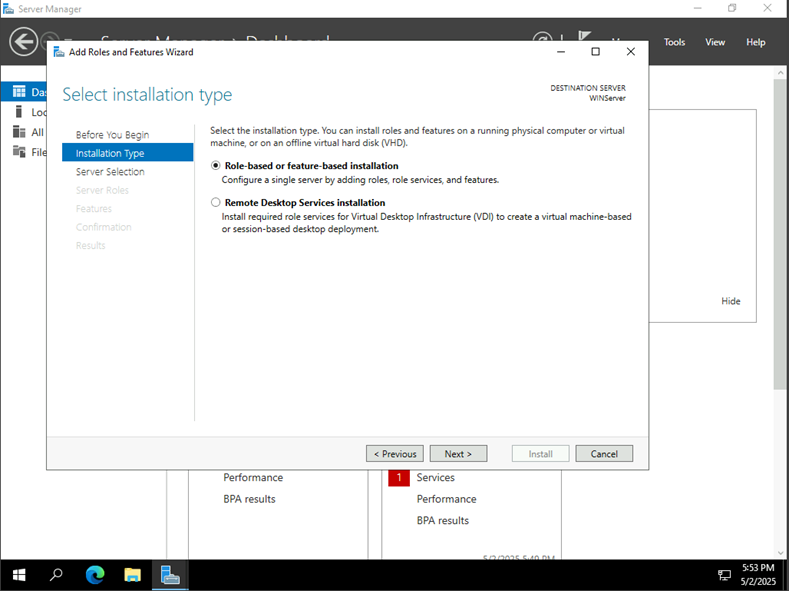

2.	[Role-based or feature-based Installation]를 선택하고 [Next]를 클릭합니다.
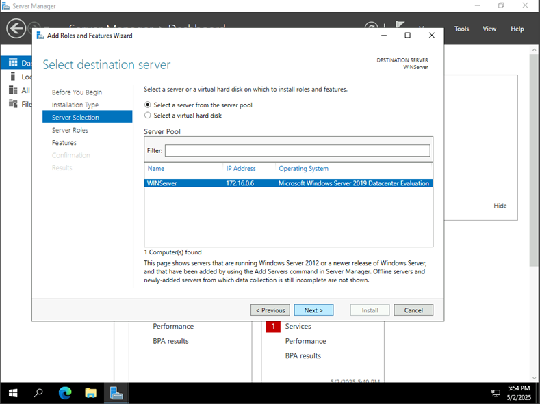

3.	Select Server Role 단계에서 [Active Directory Domains Service]와 [DNS Server]를 선택합니다.
 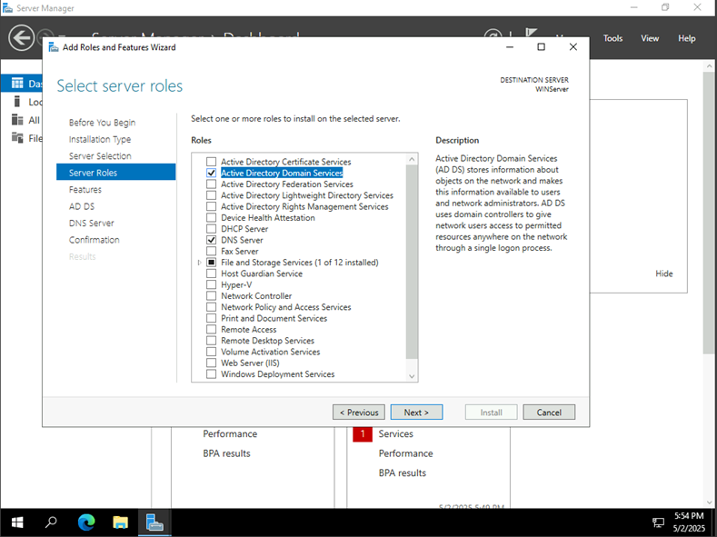

4.	Select Features 단계에서는 설정없이 [Next]를 클릭합니다.
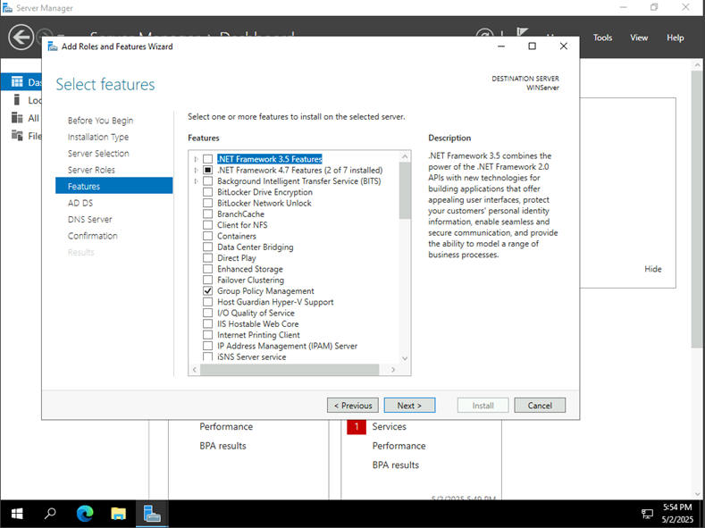

5.	Active Directory Domain Services 단계에서 [Next]를 클릭합니다.
 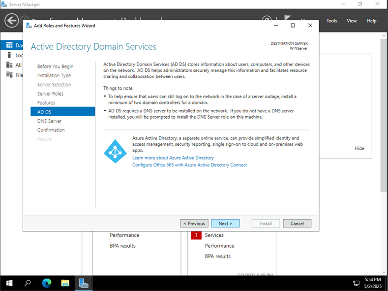

6.	DNS 단계에서 [Next]를 클릭합니다.
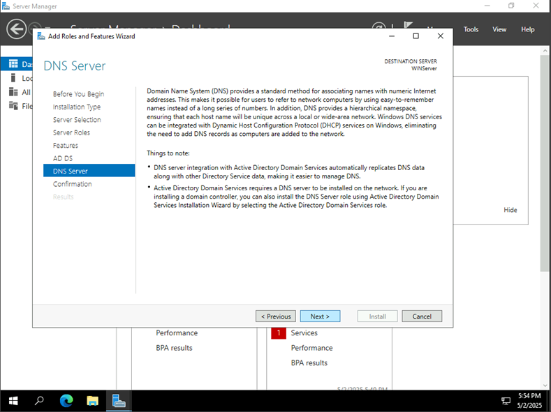

7.	Confirm Installation Selection에서 [Install]를 클릭합니다.
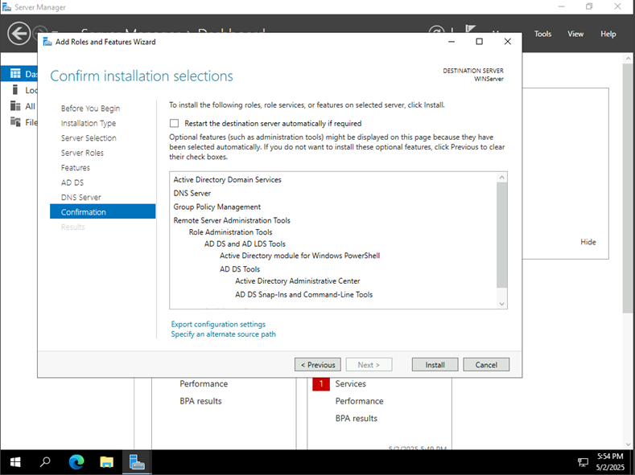

8.	설치가 완료되면 [Close]를 클릭합니다.
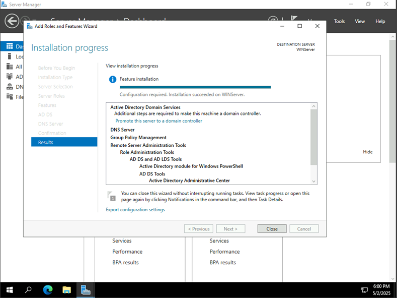
 
9.	상단 경고 아이콘을 클릭하고 Post-deployment Configuration을 진행합니다.
 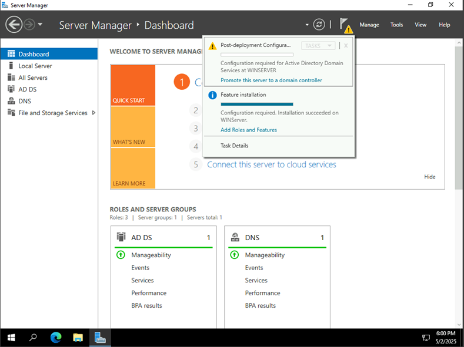

10.	Deployment Configuration 단계에서 [Add a new forest] 선택하고, 도메인 명을 입력합니다.(여기서는 실질적인 외부 도메인이 있다면, M365 관리 포탈에서 도메인에 등록된 도메인으로 일치하는 것으 권장)
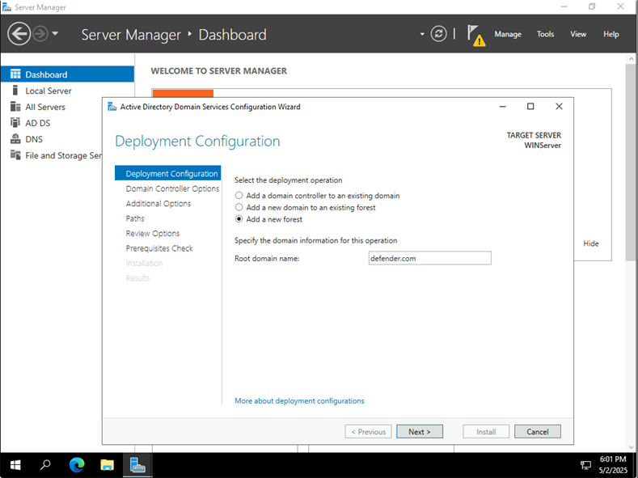
 
11.	Domain Controller Option 화면에서 복구 암호를 입력하고 [Next]를 클릭합니다.
 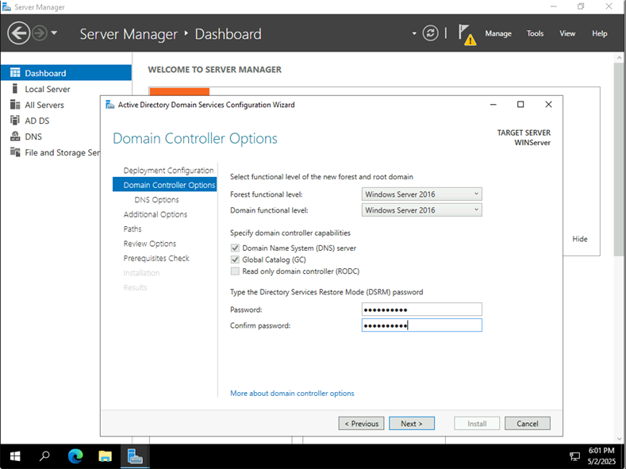

12.	DNS Option 화면에서 [Next]를 클릭합니다.
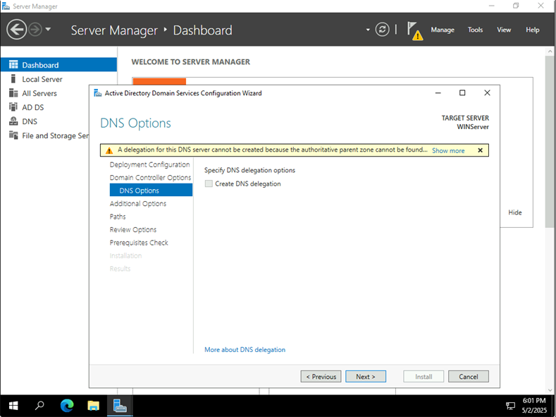 

13.	Additional Option 화면에서 [Next]를 클릭합니다.
 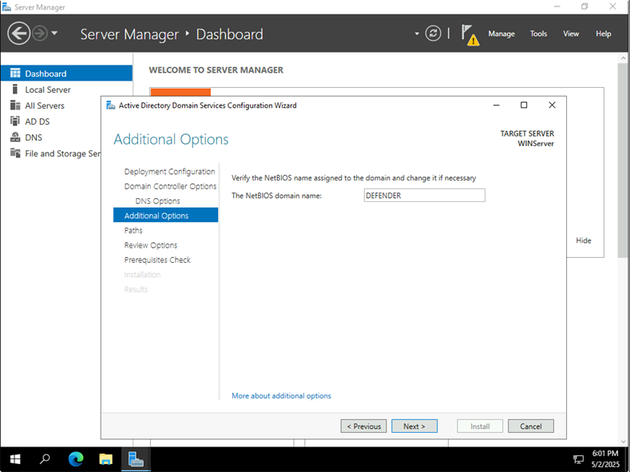

14.	Paths [Next]를 클릭합니다. 
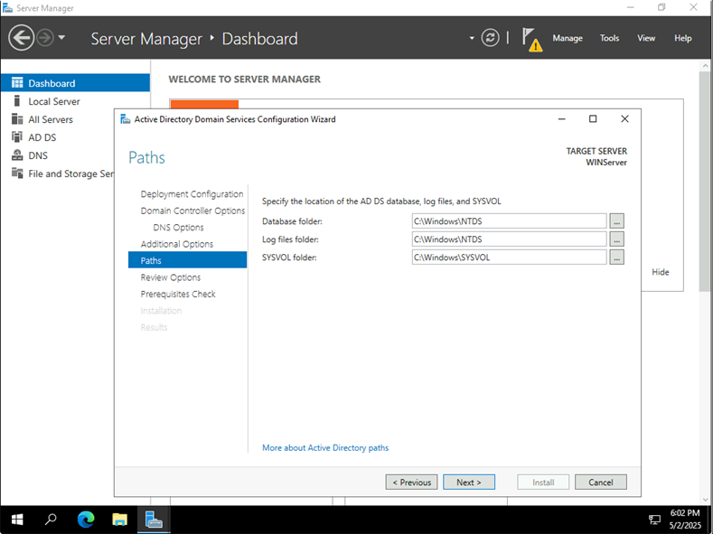

15.	Review Option 화면에서 내용 확인 후 [Next]를 클릭합니다.
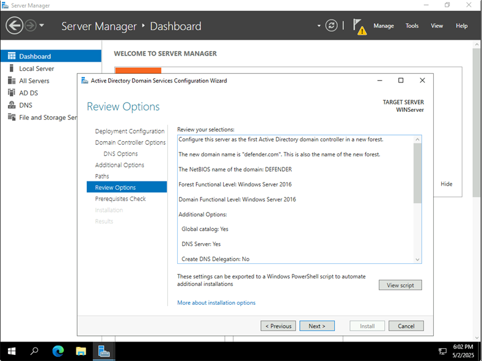

16.	Prerequisites Check 화면에서 내용 확인 후 [Install]를 클릭합니다.
 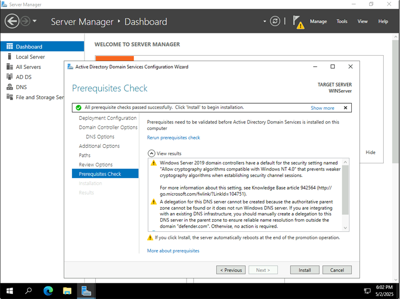

17.	설치 완료되면 재부팅이 진행됩니다. 
