1.	AD에서 System Manger – Tool - Active Directory Users and Computer 콘솔을 실행하고, OU 개체를 추가하고 계정을 생성합니다.
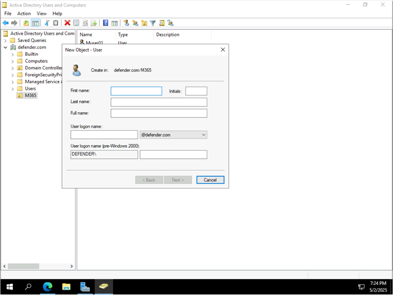

2.	계정이 생성된 계정이 나열됩니다.
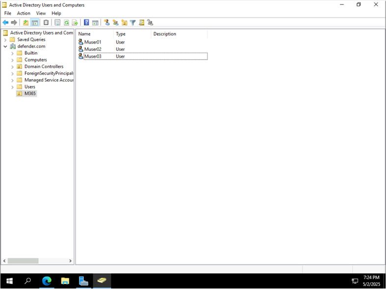

3.	MEC서버에서 Microsoft Entra Connect를 다운로드 합니다. 
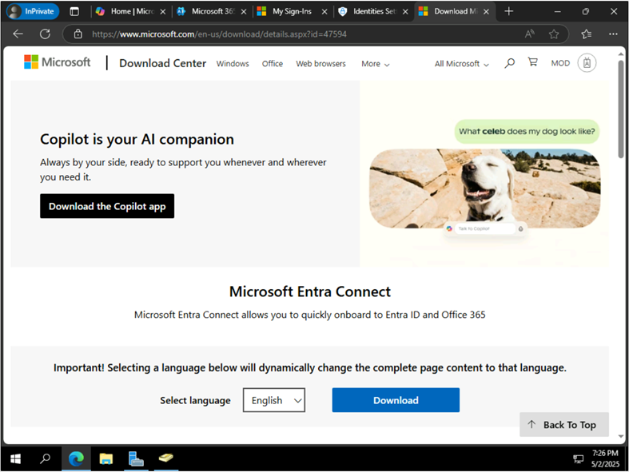
 

4.	다운로드 된 동기화 서비스 파일을 실행합니다.
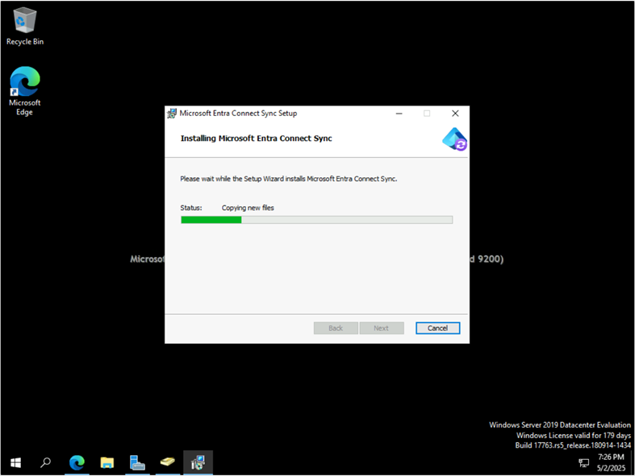

5.	Microsoft Entra Connect Sync 서비스 마법사가 실행됩니다.
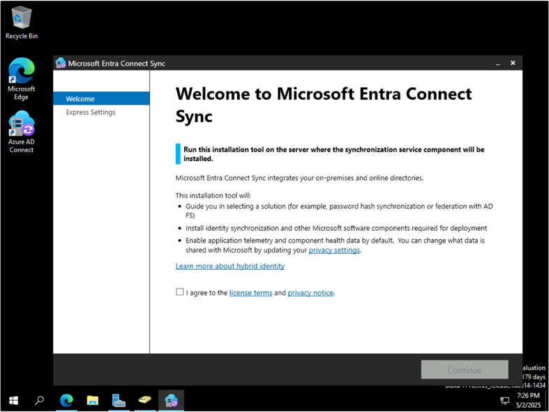

6.	Express Setting을 선택하여 실행합니다. 
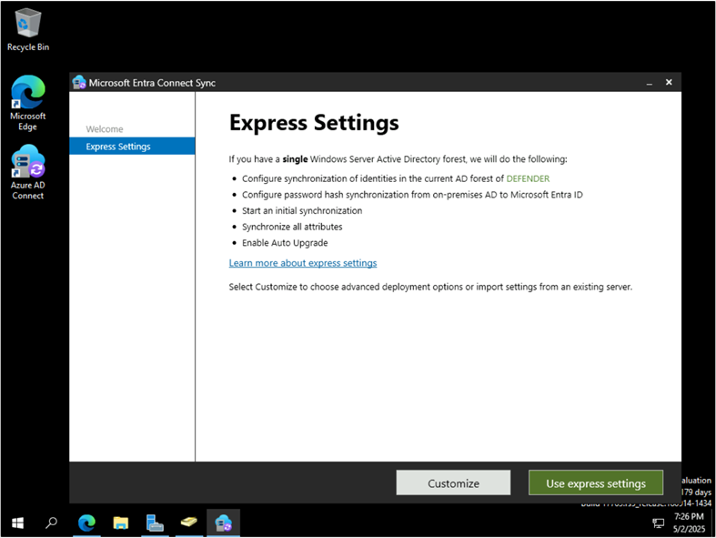


7.	Microsoft Entra ID의 전역관리자 계정을 입력하고 [Next]를 클릭합니다.
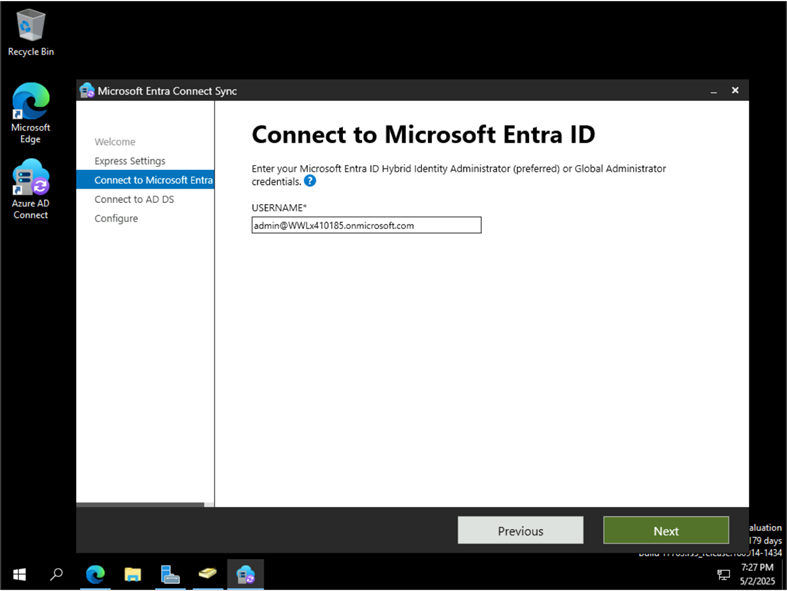
 

8.	입력한 계정의 암호를 입력하고 인증을 완료합니다.
 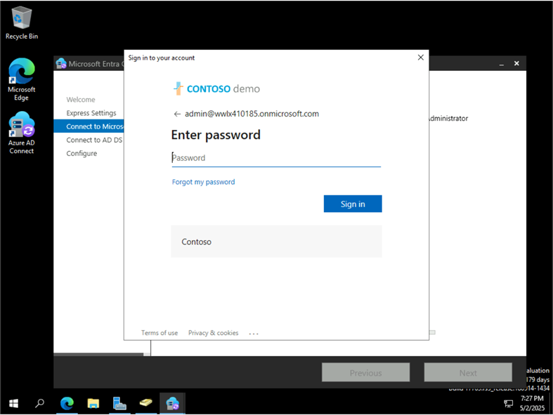


9.	AD DS 연결 단계에서는 AD의 Enterprise Administrator 그룹의 계정을 입력합니다.
 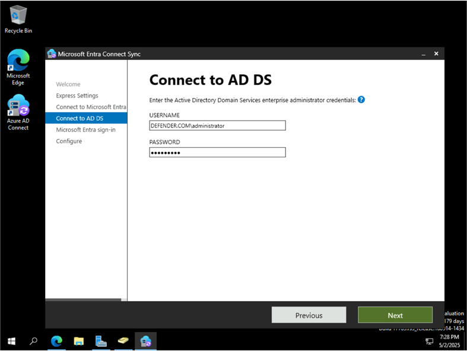


10.	Continue without matching all UPN suffixes to…를 선택한 후 [Next]를 클릭합니다.
 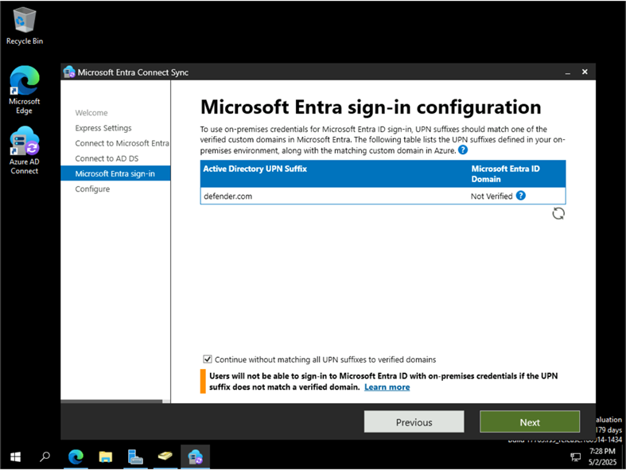


11.	설치 준비가 완료되면 [Install]를 클릭합니다.
 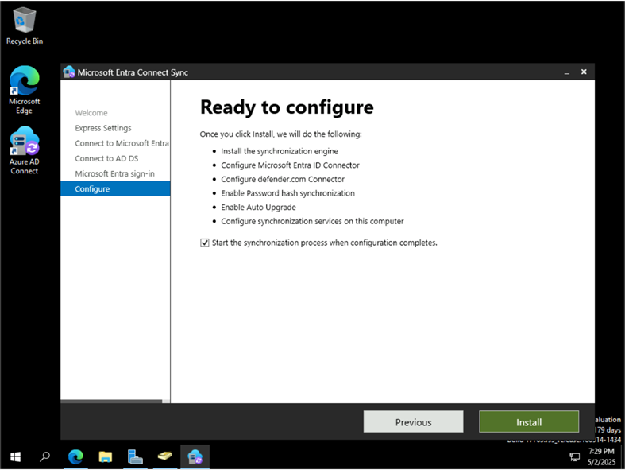

12.	설치가 완료된 메시지를 확인한 후 [Exit]를 클릭합니다.
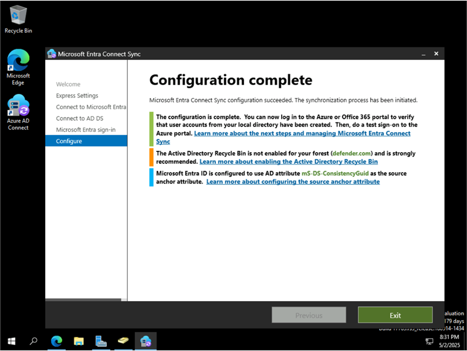
 
13.	Synchronization Service Manager를 실행하면 계정 동기화 작업이 진행되는 것을 확인할 수 있습니다. 
 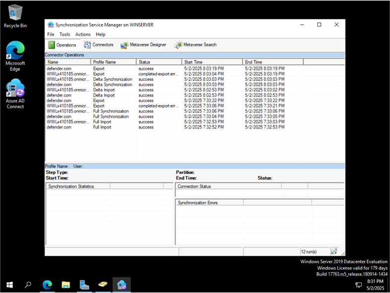

14.	동기화 진행이 완료되면 다음과 같이 M365 포탈 사용자 계정에 추가된 것을 확인할 수 있습니다.(참고, M365 관리 포탈에 개인 도메인을 추가하지 않은 상태라 OOO.onmicrosoft.com으로 나타납니다.)
 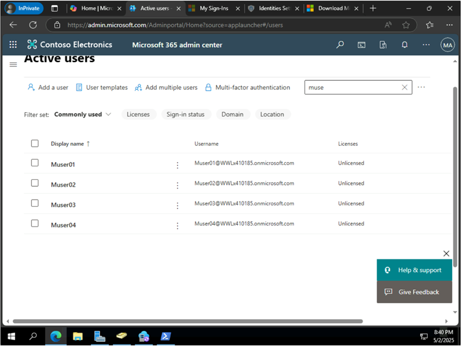

15.	참고사항으로 빠르고, 강제로 동기화를 진행하는 경우는 Powershell을 실행한 후 다음과 같 명령어를 실행합니다.
Import-Module ADSync

``` powershell 
변경된 사항만 동기화 실행
Start-ADSyncSyncCycle -PolicyType Delta
or
전체 동기화 실행
Start-ADSyncSyncCycle -PolicyType Initial


