1.	AD 서버에서  https://security.microsoft.com, 사이트에 접속한고, Microsoft Defender 포탈에서 [setting] – [Identities]를 클릭합니다.<br>
 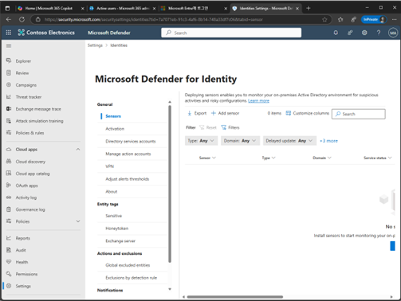
 
2.	설명화면에서 [General] – [Server]를 클릭하면 나타나는 팝업에서 [Continue with the Classic…]를 클릭합니다.<br>
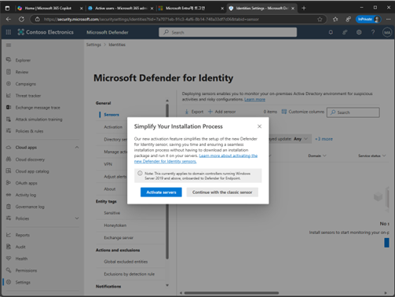
 
3.	[Download installer]를 클릭하여 설치 파일을 다운로드하고, Access Key를 복사합니다.<br>
 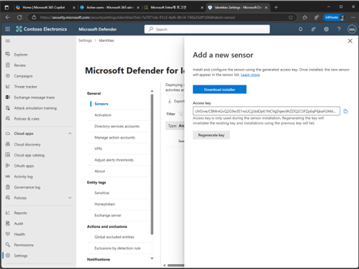

4.	다운로드 파일 압축을 해제 후 설치를 실행합니다.<br>
 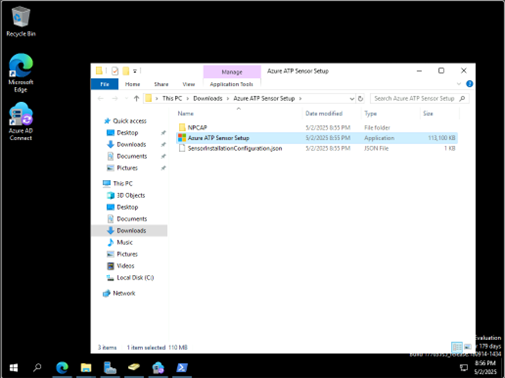


5.	설치 마법사가 나타나면 언어를 선택한 후 [Next]를 클릭합니다.<br>
 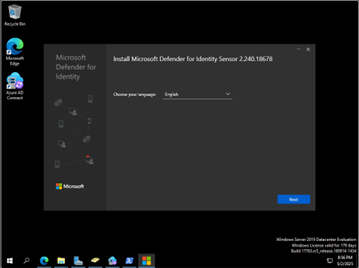

6.	센서 배포 타입에서 [Sensor]를 선택하고 [Next]를 클릭합니다.<br>
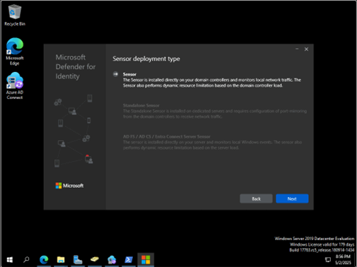 


7.	센서 구성 단계에서 앞에서 복사한 Access Key를 붙여넣기하고 [Install]를 클릭하여 설치를 진행합니다.<br>
 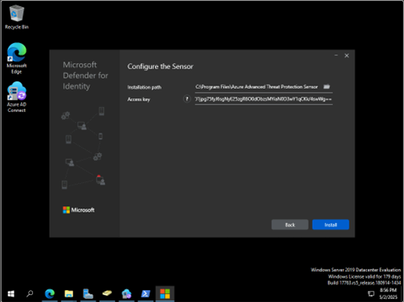

8.	MDI 센서 설치가 완료된 메시를 확인합니다.<br>
 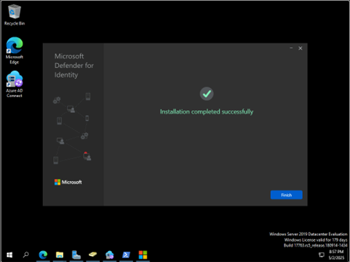


9.	MDI 설정화면에서 MDI 센서를 설치한 서버와 상태를 확인할 수 있습니다.<br>
 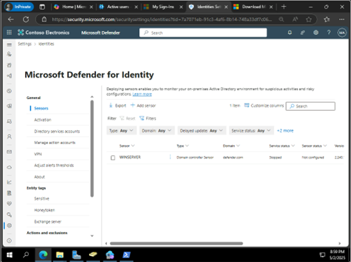

10.	디렉토리 서비스 계정 설정하면에서 [Add Creden..]를 클릭합니다.<br>
 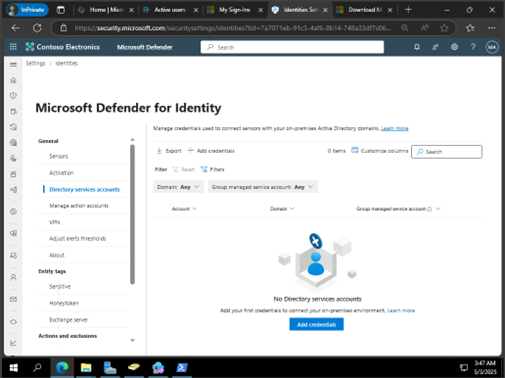


11.	계정 이름과 [Group managed service account]를 선택하고, 도메인을 입력하고 [save]를 클릭합니다. (데모 환경이라 임시적으로 도메인 관리자 계정 입력)<br>
 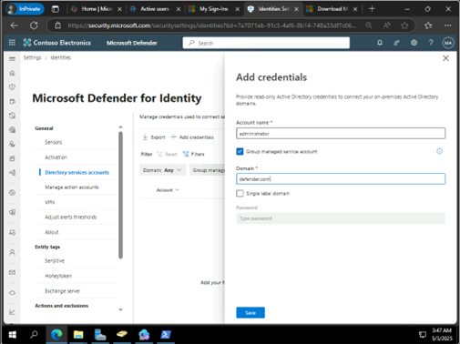


12.	디렉토리 서비스 사용자 계정이 추가되고 상태를 확인합니다.<br>
 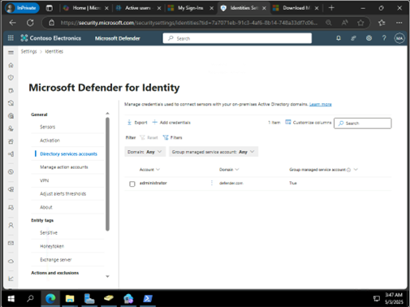


13.	Powershell를 실행하고, 
``` Powershell
Install-Module -Name DefenderForIdentity
```
명령어를 실행합니다 <br>
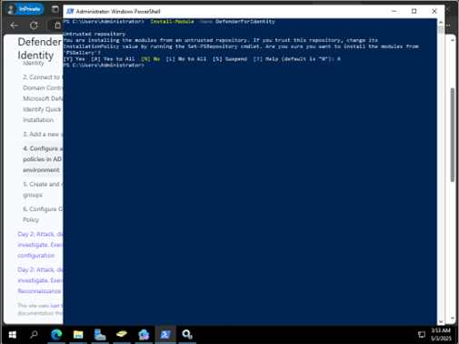

14.	다음 명령어를 실행하여 감사 정책에 대한 설정을 확인할 수 있습니다. <br>
``` Powershell
New-MDIConfigurationReport -Path "C:\Reports" -Mode Domain -OpenHtmlReport
```
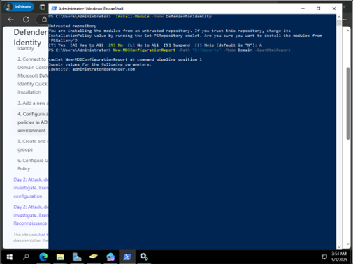
 
15.	다음과 같이 결과가 Failed로 나타나는 부분의 정책을 추가하거나 수정해야 합니다.<br>
 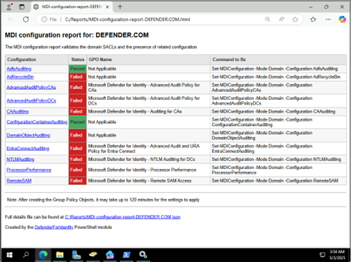

 
16.	수정하는 방법은 Command to fix의 명령어를 Powershell에서 실행하고, <br>

``` Powershell
New-MDIConfigurationReport -Path "C:\Reports" -Mode Domain -OpenHtmlReport
```

를 실행하여 결과를 확인합니다.<br>
 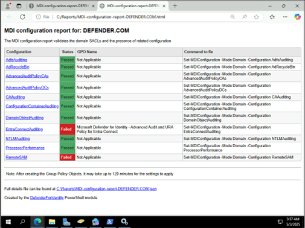
 

17.	위의 화면에서 일부 failed 부분의 정책은 그룹정책 편집기를 실행하고, [New]를 클릭하여 정책을 생성합니다.<br>
 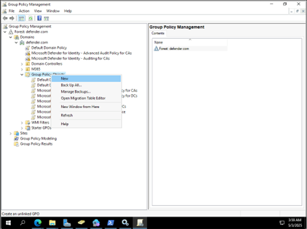
 

18.	Microsoft Defender for Identity – Advanced Audit and URA Policy for Entra Connect를 입력하고 [OK]를 실행합니다.<br>
 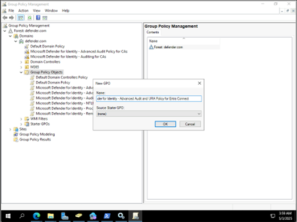
 

19.	생성된 정책을 편집을 클릭합니다.<br>
 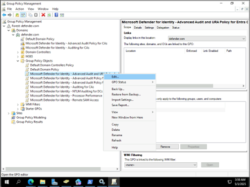

20.	다음 정책 위치로 이동하여  Computer Configuration\Policies\Windows Settings\Security Settings\Advanced Audit Policy Configuration\Audit Policies\Logon/Logoff\Audit Logon을 실행합니다.<br>
 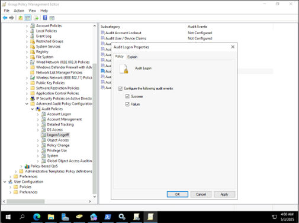

21.	[Success] / Failure]를 모두 선택하여 설정책을 설정합니다.<br>
 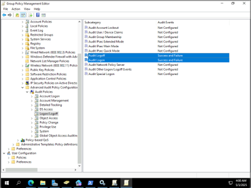

22.	생성한 그룹정책을 연결 합니다.<br>
 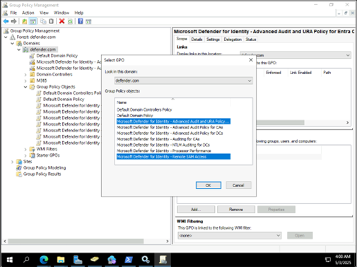


23.	오류가 발생된 정책에 대해서 나열된 부분을 확인하고 그룹정책 편집기를 종료합니다.<br>
 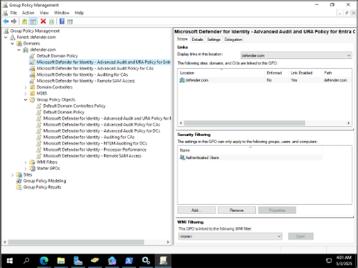

24.	
``` Powershell
New-MDIConfigurationReport -Path "C:\Reports" -Mode Domain -OpenHtmlReport
```
를 실행하여 감사 정책 상태를 확인합니다.<br>
 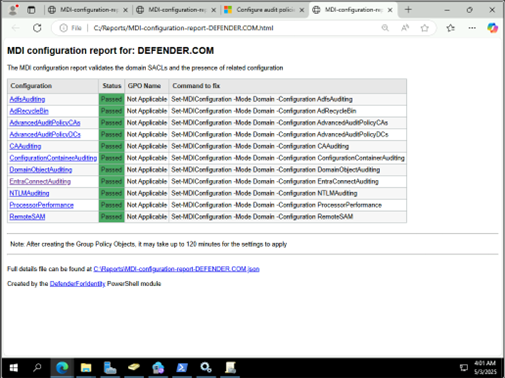

25.	MDI 설정 페이지에서 시간이 지나고, Health Status가 [healthy] 녹색 상태로 변경되면 정상적으로 센서 설치 구성이 완료됩니다.<br>
  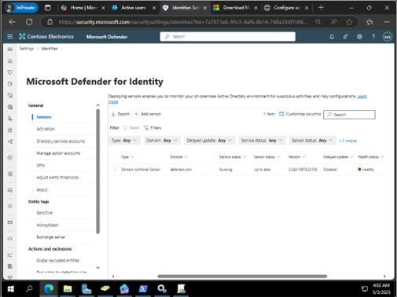


>⚠️ **IMPORTANT:**
** (중요) Windows Server 2025 환경에서 다음 명령어를 실행시 발생하는 경우는 다음과 같은 방법으로 해결 합니다. 

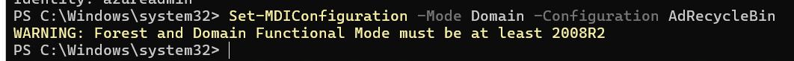

1단계: 실제 기능 수준 및 휴지통 상태 확인
GPO나 스크립트가 오작동하는지 확인하기 위해, 실제 AD 포리스트 수준과 휴지통이 켜져 있는지 수동으로 점검해야 합니다. AD 관리자 권한이 있는 PowerShell 창에서 아래 명령어를 실행하세요.


### 1. 도메인 및 포리스트 기능 수준 확인
``` Powershell 
(Get-ADDomain).DomainMode
(Get-ADForest).ForestMode
```

### 2. AD 휴지통 기능 활성화 여부 확인
``` PowerShell
 Get-ADOptionalFeature -Filter "Name -eq 'Recycle Bin Feature'" | Select-Object Name, EnabledScopes
 ```

만약 EnabledScopes가 비어 있다면, 기능 수준은 높지만 휴지통 기능 자체가 꺼져 있는 상태입니다.

2단계: Active Directory 휴지통 수동 활성화 (필요 시)
MDI가 정상적으로 도메인 내 개체 삭제 이벤트를 추적하려면 AD 휴지통이 반드시 켜져 있어야 합니다. 만약 1단계에서 휴지통이 꺼져 있는 것을 확인했다면 아래 명령어로 강제 활성화합니다.


### AD 휴지통 기능 수동 활성화 (도메인명은 본인 환경에 맞게 자동 매핑됩니다)
```Powershell
Enable-ADOptionalFeature -Identity 'Recycle Bin Feature' -Scope ForestOrConfigurationSet -Target (Get-ADForest).RootDomain
```
주의: AD 휴지통은 한 번 활성화하면 다시 비활성화할 수 없으나, Windows Server 2008 R2 이후 환경에서는 보안 및 복구를 위해 기본 활성화가 권장되는 정석 설정입니다.