1.	Client PC를 도메인 조인을 위하여 DNS의 주소를 AD Server의 IP 주소로 변경합니다.<br>
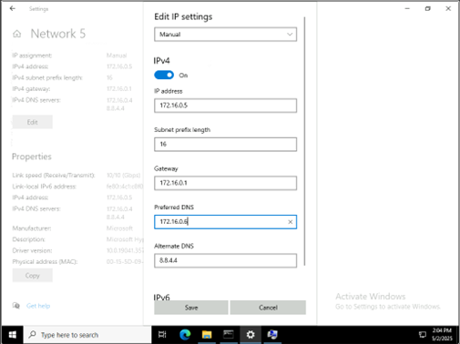
 
2.	도메인 조인을 가입합니다.<br>
 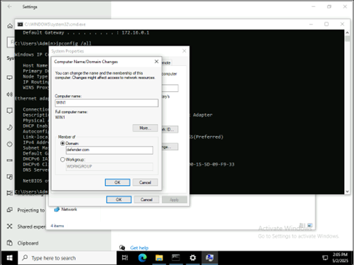

3.	AD 관리자 계정과 암호를 입력합니다.<br>
 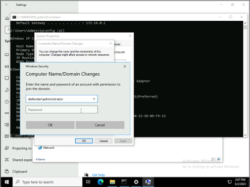


4.	도메인 조인 완료된 메시지를 확인한 후 재부팅을 진행합니다.<br>
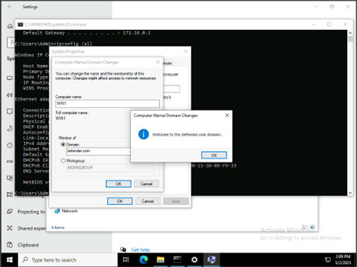 


5.	AD 서버에서 다음 명령을 실행합니다.<br>

```cmd 
# Set the variables:
$domainComponent = "Winserver

# Create users:
Net user RonHD Passw0rd12!@ /FULLNAME:"Ron HD" /DOMAIN /add
Net user JeffL Passw0rd12!@ /FULLNAME:"Jeff Leatherman" /DOMAIN /add
Net user SamiraA Passw0rd12!@ /FULLNAME:"Samira Abbasi" /DOMAIN /add 
Net user HoneyTokenTest Passw0rd12!@ /FULLNAME:"HoneyTokenTest" /DOMAIN /add 
``` 

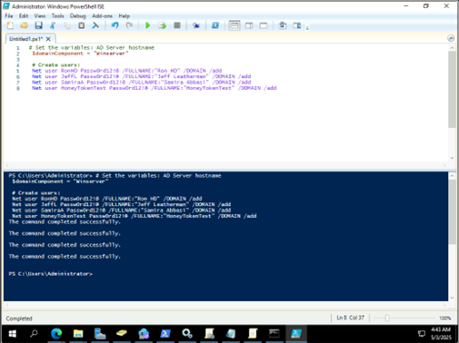
 

```PowerShell
# Add SamiraA to Domain Admins
Add-ADGroupMember -Identity "Domain Admins" -Members SamiraA
``` 

```PowerShell
# Create HelpDesk group
New-ADGroup -Name HelpDesk -GroupScope Global -GroupCategory Security -Path "DC=$domainComponent,DC=local"

#Add RonHD to HelpDesk group
Add-ADGroupMember -Identity HelpDesk -Members RonHD

################### 참고문
Invoke-Command -ComputerName WIN1 -ScriptBlock { net localgroup Administrators defender\jeffl /add }
Invoke-Command -ComputerName WIN6 -ScriptBlock { net localgroup Administrators defender\Jeffl /add }
####################
```

7.	참고문 부분의 명령 실행시 다음과 같은 오류가 발생되는 경우에는 다음과 같은 조치를 진행합니다.<br>
 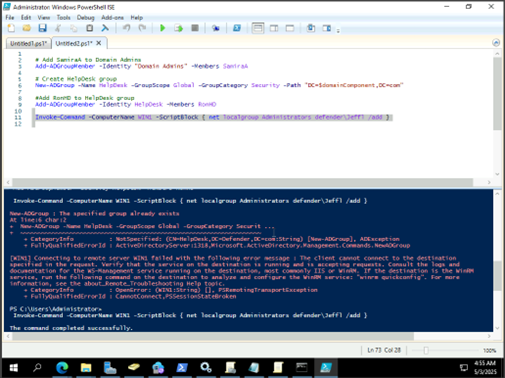


8.	Client PC의 서비스에서 Windows Remote Manage… 서비스를 활성화 합니다. <br>
 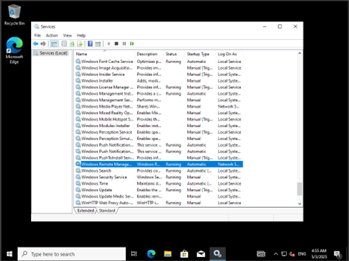

9.	Client에서 서비스 활성후 명령을 실행하면 다음과 같은 결과를 확인할 수 있습니다. <br>
 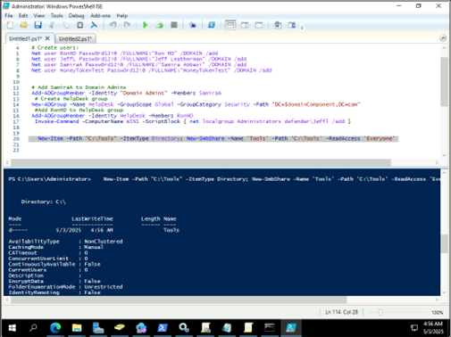


10.	다음 명령어을 실행하여 폴더를 생성하고, Defender의 예외처리를 진행합니다.<br>
```PowerShell
New-Item -Path "C:\Tools" -ItemType Directory; New-SmbShare -Name 'Tools' -Path 'C:\Tools' -ReadAccess 'Everyone'

Set-MpPreference -DisableRealtimeMonitoring $true
Set-MpPreference -MAPSReporting 0
Set-MpPreference -SubmitSamplesConsent 2
Add-MpPreference -ExclusionPath 'C:\Tools','C:\Users\{AD관리자계정}\Downloads'
```

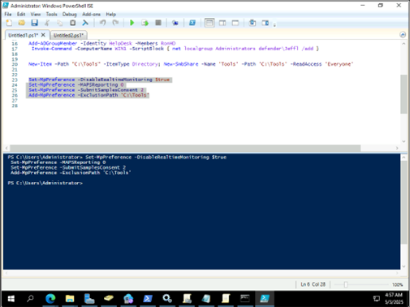

11.	MDI 설정화면에서 Adjust alerts thre… 메뉴의 Recommanded test mode로 활성화 합니다.<br>

 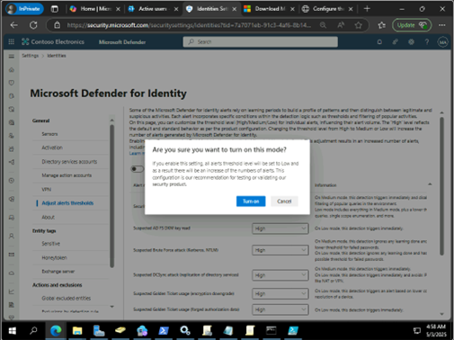

12.	MDI 설정이 테스트 모드 상태로 설정된 부분을 확인합니다.<br>
 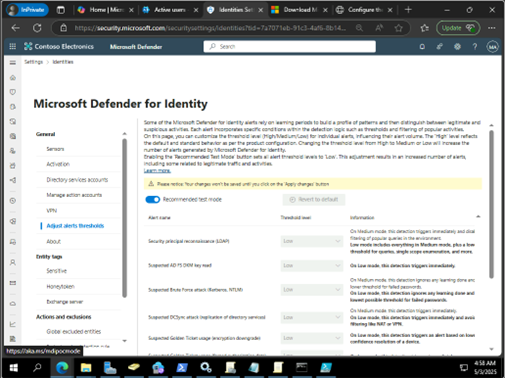

13.	다음 링크를 통하여 위협 테스트 툴을 다운로드 받아 Tools 폴더로 이동하고 압축을 해제합니다. <br>
Netsess 툴 : https://www.joeware.net/freetools/tools/netsess/<br>
Mimikatz 툴 : https://github.com/gentilkiwi/mimikatz/releases<br>
ORADAD 툴 : https://github.com/ANSSI-FR/ORADAD/releases<br>
Ghostpack Rubeus 툴 : https://github.com/r3motecontrol/Ghostpack-CompiledBinaries<br>
PST툴 : https://learn.microsoft.com/en-us/sysinternals/downloads/psexec<br>

 
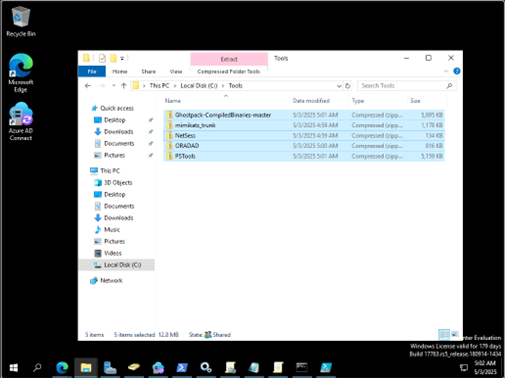


14.	추가적으로 Client PC에서 다음 Powershell 명령어를 실행하여 복사합니다.<br>
```Powershell
# Create the directory if it doesn't exist
New-Item -Path "C:\Tools" -ItemType Directory -Force
#Exclude C:\Tools from Defender
Add-MpPreference -ExclusionPath 'C:\Tools'
# Copy the contents from \\DC01\tools to C:\Tools
Copy-Item -Path "\\Winserver\tools\*" -Destination "C:\Tools\" -Recurse -Force
```

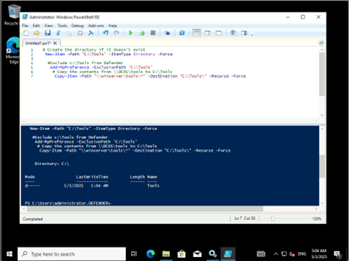
 

