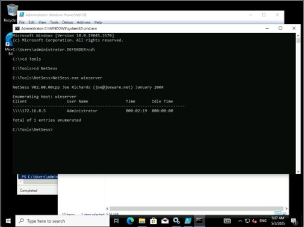
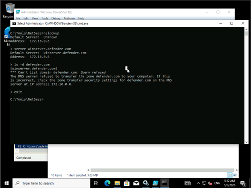
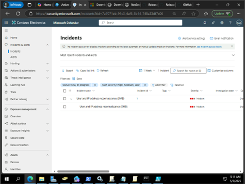
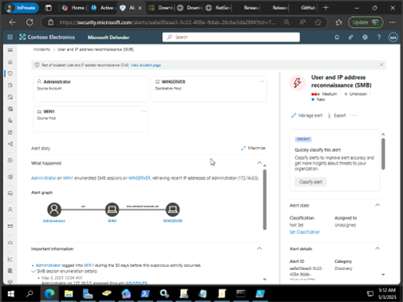

# MDI 위협 시나리오 테스트(Persistence and privilege escalation alerts)


1.	이 검색에서는 도메인 컨트롤러에 대해 SMB 세션 열거가 수행될 때 경고가 트리거됩니다.
사용자와 컴퓨터는 GPO를 검색하기 위해 최소한 SYSVOL 공유에 액세스해야 합니다. 공격자는 이 정보를 사용하여 사용자가 최근에 로그인한 위치를 파악하고 네트워크에서 횡적으로 이동하여 특정 중요한 계정에 액세스할 수 있습니다.<br>

2.	다음 명령을 실행합니다.<br>
```cmd
c:\Tools\Netsess\NetSess.exe DC01
```

 

 
4.	DNS 프로토콜에는 여러 쿼리 유형이 있습니다. 이 Defender for Identity 보안 경고는 DNS가 아닌 서버에서 시작된 AXFR(전송)을 사용하는 요청 또는 과도한 수의 요청을 사용하는 요청 등 의심스러운 요청을 검색합니다.<br>

```cmd
Nslookup
Server DC01.MSMDI.local
ls -d MSMDI.local
exit
```


 

 
6.	Microsoft Defender 포탈의 Incident & alerts 메뉴에서 다음과 “User and IP address reconnaissance (SMB)” 가 생성된 것을 확인할 수 있습니다.<br>
 

7.	세부적인 내용을 확인하여 분석이 가능합니다.<br>
 
