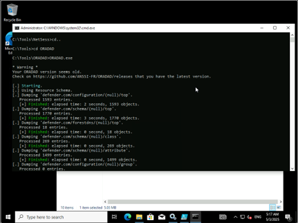
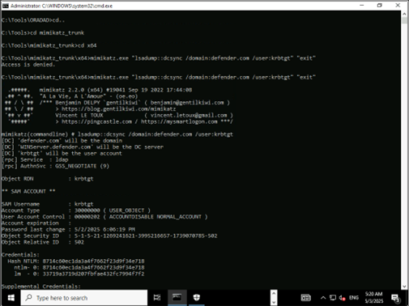
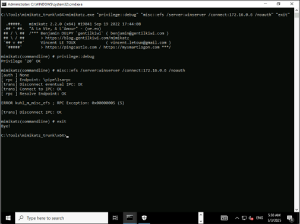
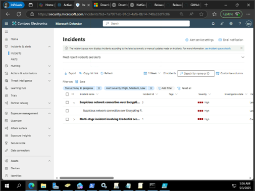
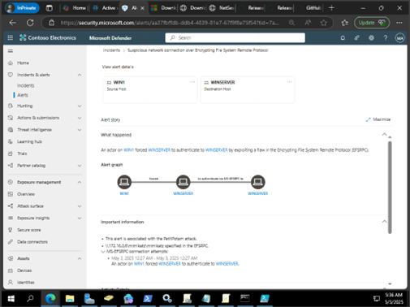

# MDI 위협 시나리오 테스트(Credential access alerts)


Defender for Identity는 Kerberoasting 공격의 첫 번째 단계로 일반적으로 사용되는 LDAP 보안 주체 정찰을 찾습니다. Kerberoasting 공격은 SPN(Security Principal Name)의 대상 목록을 가져오는 데 사용되며, 공격자는 이를 위해 TGS(Ticket Granting Server) 티켓을 얻으려고 시도합니다.<br>

1.	Client PC에서 다음 명령을 실행합니다. 	<br>
```cmd 
c:\Tools\ORADAD\ORADAD.exe
```
 

 
2.	공격자에게 DS-Replication-Get-Changes-All 권한이 있는 경우 복제 요청을 시작하여 krbtgt의 암호 해시와 같이 Active Directory에 저장된 데이터를 검색할 수 있습니다.

Client에서 사용자 계정으로 로그인 후 다음 명령어를 실행합니다.<br>
```cmd
c:\Tools\mimikatz_trunk\x64\mimikatz.exe "lsadump::dcsync /domain:defender.com /user:krbtgt" "exit"
```

	 

 
3.	Defender for Identity는 공격자가 도구를 사용하여 서비스 계정 및 해당 SPN(서비스 주체 이름)을 열거하고, 서비스에 대한 Kerberos 서비스 티켓을 요청하고, 메모리에서 TGS(Ticket Granting Service) 티켓을 캡처하고, 해시를 추출하고, 나중에 오프라인 무차별 암호 대입 공격에서 사용하기 위해 저장하는지 확인합니다.<br>

```cmd
c:\Tools\Rubeus.exe kerberoast /dc:DC01 /creduser:defender.com\JeffL /credpassword:Passw0rd12!@
```



 
4.	Microsoft Defender 에서 다음과 같이 인시트던트가 생성됩니다. “Security principal reconnaissance (LDAP)”<br>

 

5.	인시던트를 클릭하여 세부적인 사항에 대한 분석이 가능합니다.<br>
 
