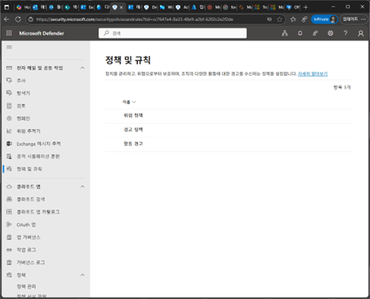
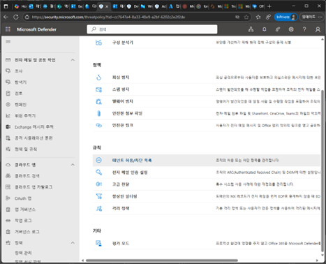
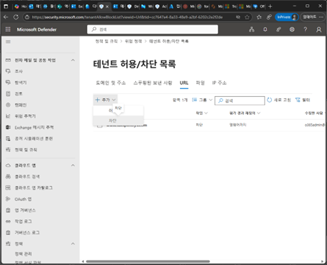
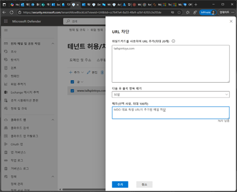
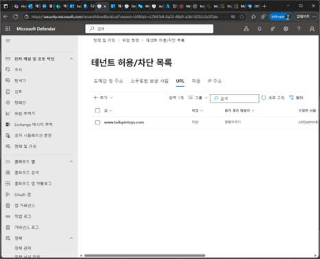
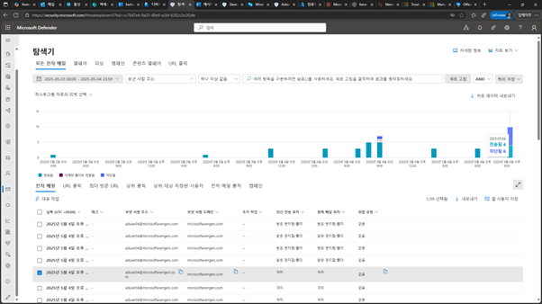

# 작업 1. 이메일에 사용할 수 없는 URL을 차단

#### 여기에서는 이메일에 나타나는 특정 URL을 차단하는 기능을 테스트합니다. 이를 통해 사용자를 의심스러운 웹사이트로 보내 자격 증명을 포기하도록 속일 수 있는 표적 피싱 공격으로부터 조직을 보호할 수 있습니다. 이러한 차단된 URL이 포함된 전자 메일 메시지는 신뢰도가 높은 피싱으로 차단되고 사용자 받은 편지함으로 배달되는 대신 격리됩니다.

1.	Microsoft Defender 관리 포탈에서 [전자메일 및 공동 작업] – [정책 및 규칙] 메뉴에서 [위협 정책]을 클릭합니다 . 
 

 
3.	[규칙] – [테넌트 허용/차단 목록]을 클릭합니다.  
 

4.	테넌트 허용/차단 목록에서 [추가] – [차단]을 클릭합니다.  
 

 
6.	URL 차단 화면에서 차단한 URL을 추가하고, 차단된 메시지에 대해서 자동 삭제 대한 부분의 기간을 설정하고, 메모를 입력하여 추가합니다. 
 

7.	테넌트 허용/차단 목록 리스트에 추가됩니다.  
 

 
9.	메일에서 “www.tailspintoys.com” 을 포함하는 메일을 전송합니다.  

10.	Microsoft Defender 포탈에서 [전자메일 및 공동작업] –[탐색기]를 클릭하여 [모든 전자 메일]을 클릭하며 URL이 포함된 메일이 격리된 것을 확인할 수 있습니다. (약 10분 정도 이후에 업데이트 됩니다.) 
 

