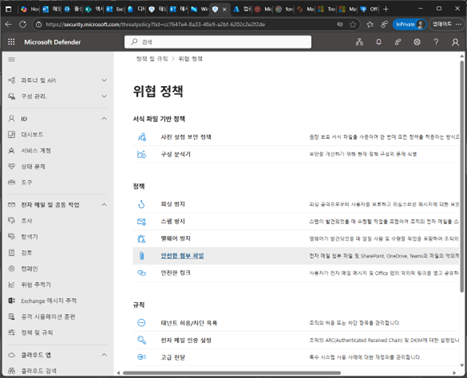
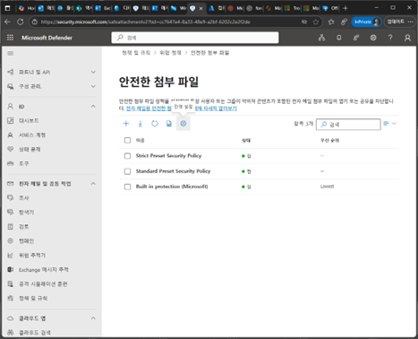
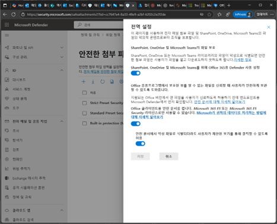
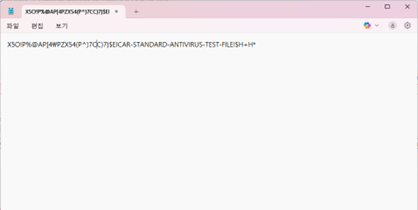
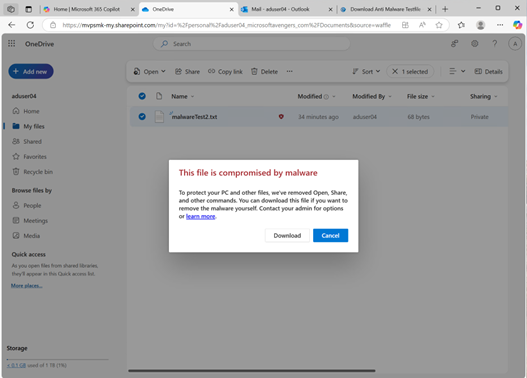
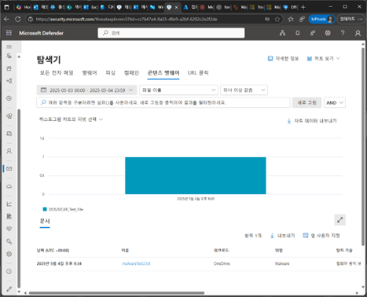

# 작업 2. SPO/Onedrive 맬웨어 파일 업로드 제한
#### OneDrive에 대한 안전한 첨부 파일 정책이 작동하는 것을 보여주기 위해 바이러스 백신 테스트 파일을 만들고 업로드합니다. 이것은 단순히 무해한 텍스트 파일이지만 그 내용은 맬웨어 페이로드를 에뮬레이트하기 위해 생성됩니다. 아래 단계를 완료한 후 PC에서 파일을 삭제하는 것이 좋습니다.

1.	Microsoft Defender 관리 포탈에서 [전자메일 및 공동 작업] – [정책 및 규칙] 메뉴에서 [위협 정책]에서 [안전한 첨부파일]을 클릭합니다.  
 

 
2.	안전한 첨부 파일 화면에서 [전역 설정] 아이콘을 클릭합니다. 
 

3.	전역 설정 화면에서 Sharepoint,Onedrive,Teams등의 MDO 설정을 모두 설정한 [저장]을 클릭합니다. 
 

 
4.	다음 내용을 notepad를 열어 복사/붙여넣기하고 txt 파일을 생성합니다.  https://docs.trendmicro.com/all/ent/de/v1.5/en-us/de_1.5_olh/ctm_ag/ctm1_ag_ch8/t_test_eicar_file.htm  
  

5.	Onedrive로 업로드를 진행합니다. 약 10분정도 이후에 다음과 같이 빨간색 아이콘이 추가되고 Malware라는 경고 문구 팝업이 확인됩니다. 
 

6.	Microsoft Defender 포탈에서 [전자메일 및 공동작업] –[탐색기]를 클릭하여 [콘텐츠 맬웰어]을 클릭하며 업로드한 파일이 맬웨어 처리된 것을 확인할 수 있습니다. (약 10분 정도 이후에 업데이트 됩니다.) 
 
 
