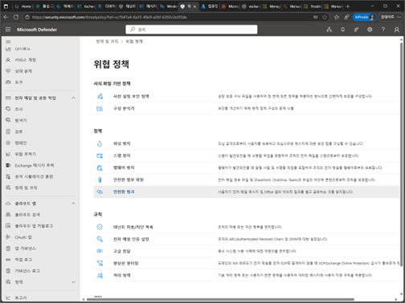
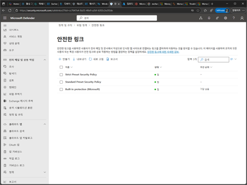
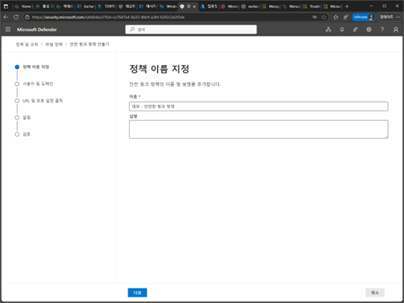
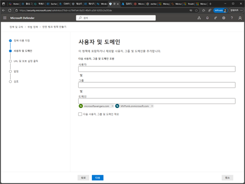
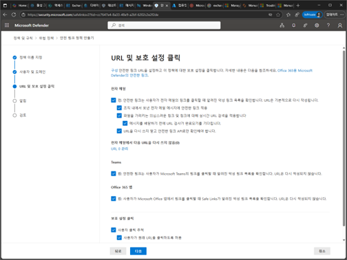
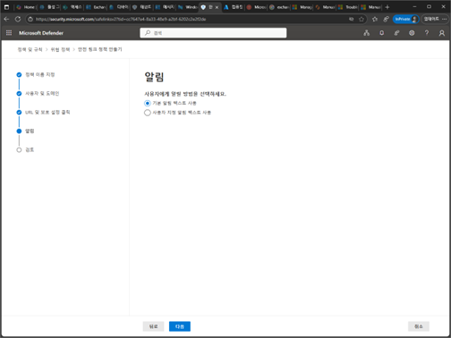
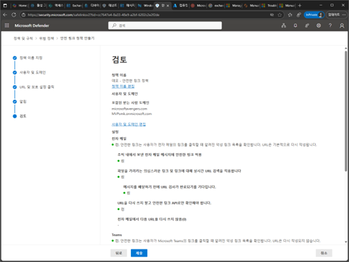
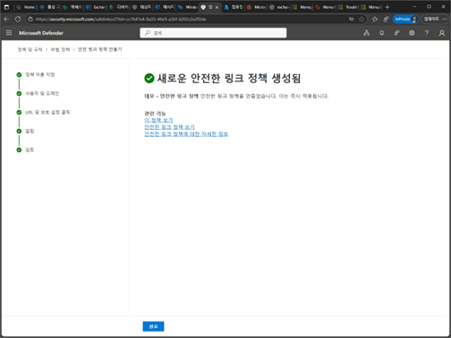

# 작업 3. 안전 링크 정책

1.	Microsoft Defender 포탈에서 [전자 메일 및 공동작업] – [정책 및 규칙]의 [위협 정책] –[안전한 링크]를 클릭합니다. 
 

2.	안전한 링크 화면에서 [만들기]를 클릭합니다. 
 

3.	정책 이름과 설정을 입력합니다. 

 

4.	사용자 및 도메인에서 안정 링크를 적용할 대상자에 대한 부분을 추가합니다. 
 

5.	URL 및 보호 설정 클릭 화면에서는 URL에 대한 액세스 처리에 대한 부분 및 보고 사항에 대한 부분을 옵션을 설정합니다. 
 

6.	알림 단계에서는 위협적인 URL에 대한 경고에 대한 알림 메일에 대한 방법을 설정합니다. 
 

7.	검토 단계에서 안전한 URL에 대한 설정 부분을 확인 후 [제출]을 클릭합니다. 
 

8.	안정한 링크 정책이 생성됩니다. 
 
