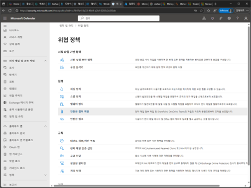
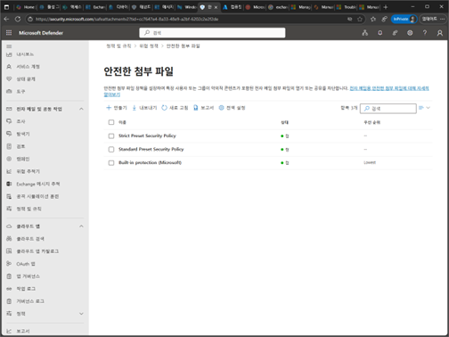
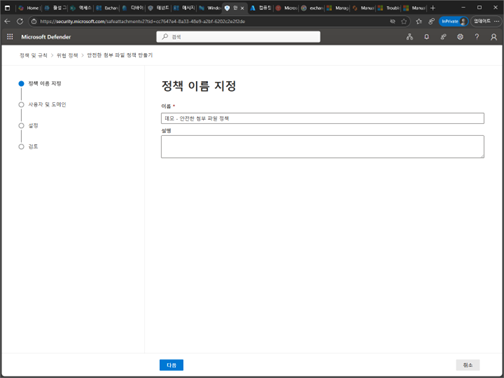
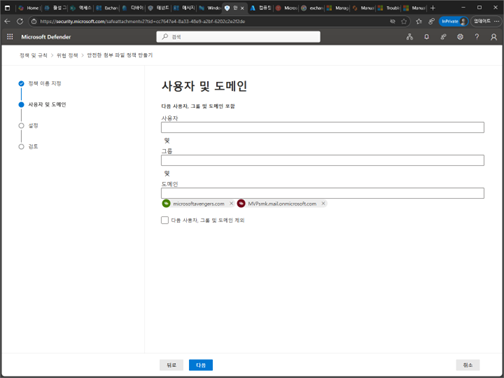
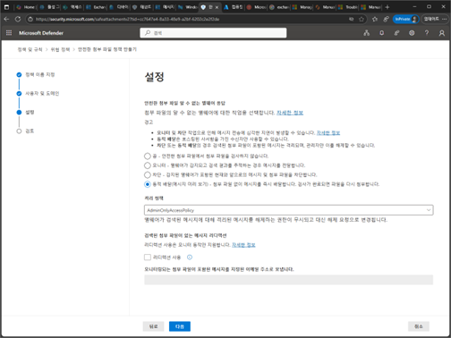
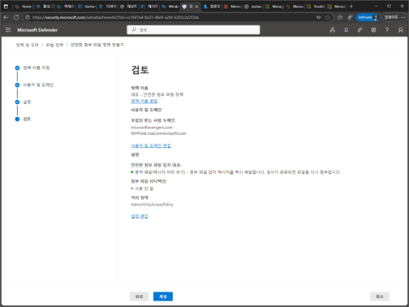
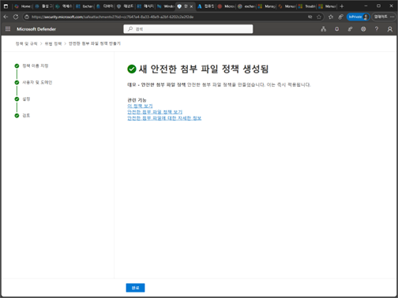

# 작업 4. 안전 첨부 정책

1.	Microsoft Defender 포탈에서 [전자 메일 및 공동작업] –[위협 정책]에서 [안전한 첨부 파일]을 클릭합니다.  
 

2.	안전한 첨부파일 정책에서 [만들기]를 클릭합니다. 
 

 
3.	정책 이름 지정에서 이름과 설명을 입력합니다. 
 

 
4.	사용자 및 도메인에서 안정 링크를 적용할 대상자에 대한 부분을 추가합니다. 
 

5.	설정 화면에서 첨부파일에 대한 부분이 스캐닝하는 부분에 대한 처리 방식에 대한 부분을 선택합니다. (권장 – 동적 배달) 
 

6.	검토 단계에서 안전한 URL에 대한 설정 부분을 확인 후 [제출]을 클릭합니다. 
 

 

7.	안전한 첨부 파일 정책이 생성되었습니다. 
 

