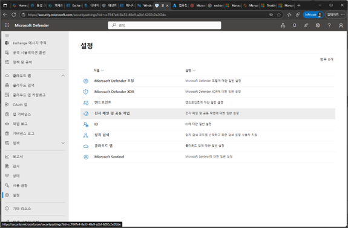
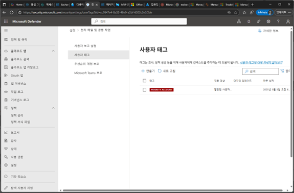
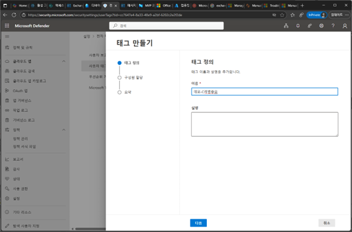
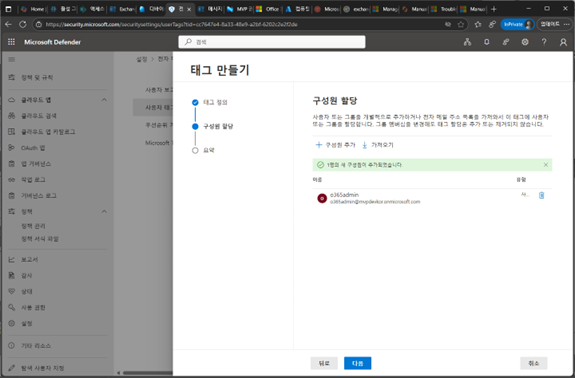
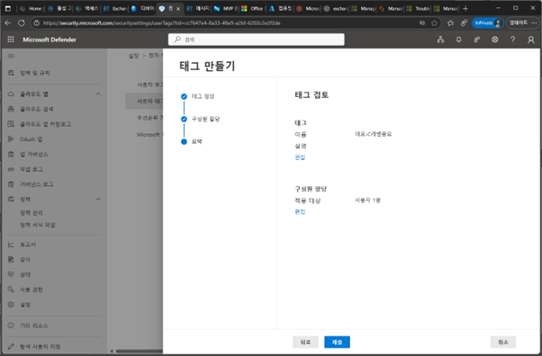
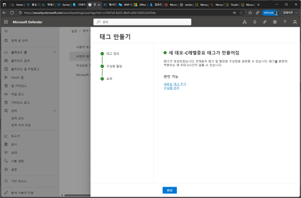
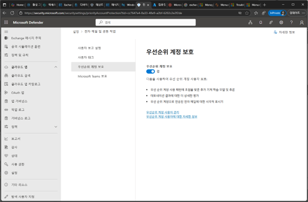

# 작업 5. 우선 순위 계정 보호

1.	Microsoft Defender 포탈에서 [설정] – [전자 메일 및 공동 작업]을 클릭합니다. 
 

2.	사용자 태그 메뉴를 클릭하고 [만들기]를 클릭합니다. 
 
 

3.	태그 만들기 단계에서 태그 [이름], [설명]을 입력합니다. 
 

 

4.	생성하는 태그에 대한 구성원을 추가하여 할당합니다. 
 
 
 
5.	생성한 태그 내용을 검토 후 [제출]을 클릭합니다. 
 
 

6.	새로운 태그 생성이 완료된 메시지를 확인합니다. 
 
 

7.	생성된 사용자 태그들이 나열되고 각 태그에서 대해서 수정 편집이 가능합니다. 
 
 

8.	[우선순위 계정 보호] 메뉴를 클릭하고 [우선 순위 계정 보호]를 활성화합니다. 
 
