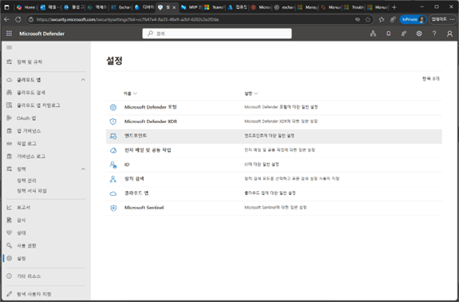
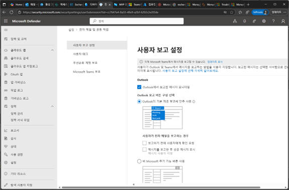
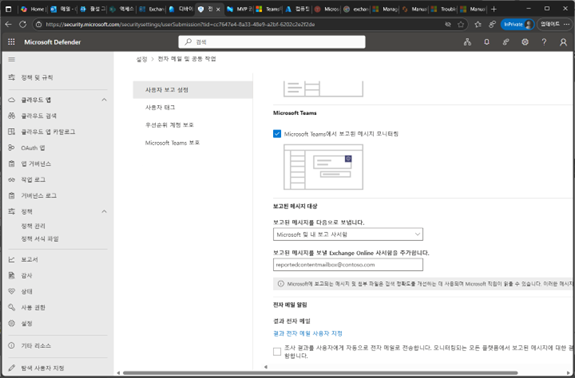
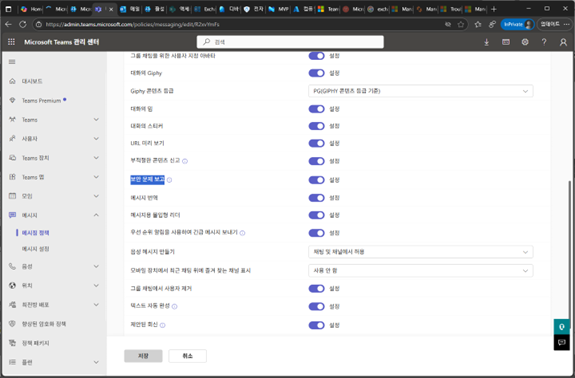
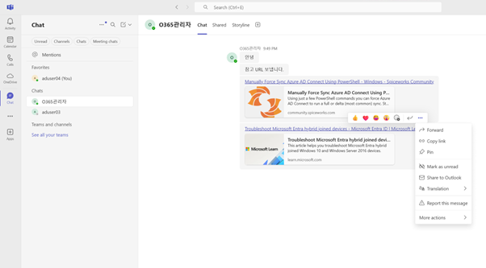
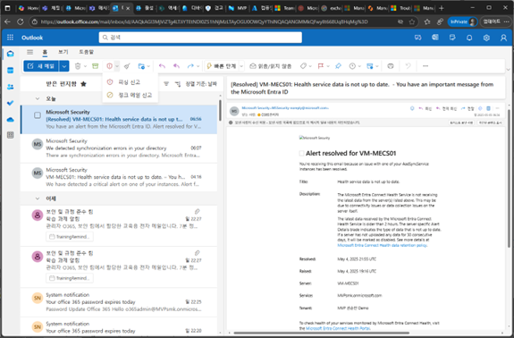

# 작업 6. Outlook 및 Teams 사용자 보고 설정

1.	Microsoft Defender 포탈의 [설정] – [전자 메일 및 공동 작업]을 클릭합니다. 
 

2.	사용자 보고 설정 메뉴에서 [Outlook 에서 보고된 메시지 모니터링]과 [Teams 에서 보고 되는 메시지 모니터링]을 활성화 합니다. 
 

3.	추가적으로 보고된 메시지에 대한 처리 방법에 대한 부분을 설정합니다. 
 

4.	Teams 관리 센터에서 [메시지] – [메시지 정책]에서 [보안 문제 보고]를 활성화하는 정책을 배포합니다. 
 
 

5.	Teams의 메시지 창에서 발생된 메시지에 “…”를 클릭하면 나타나는 [메시지 보고]를 클릭하여 관리자에게 전송할 수 있습니다.  
 

 

6.	Outlook에서는 다음과 같이 메뉴에서 [피싱 신고], [정크 메일 신고]등의 메뉴가 생성되는 것을 확인할 수 있습니다. 
 
