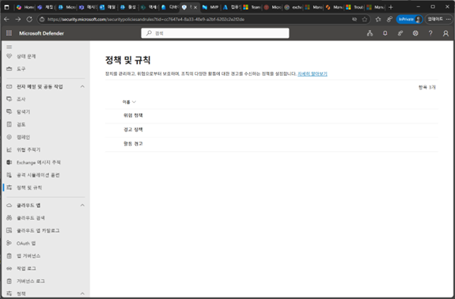
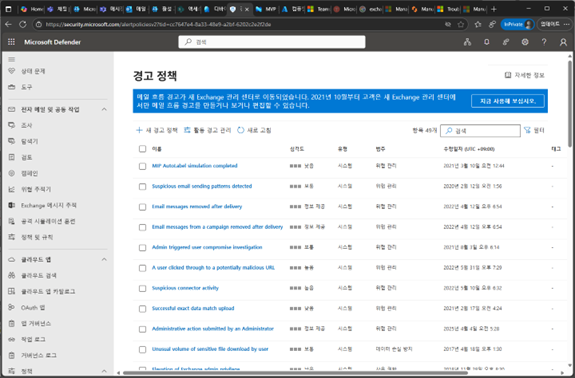
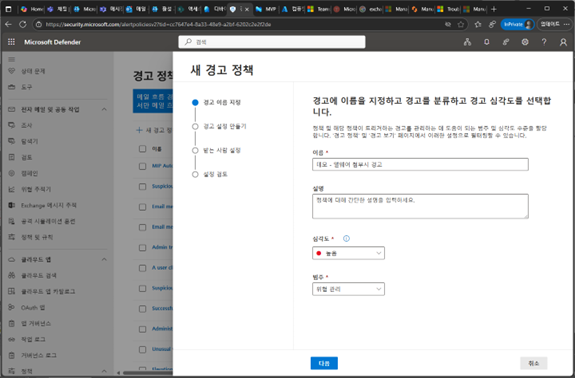
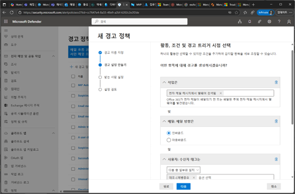
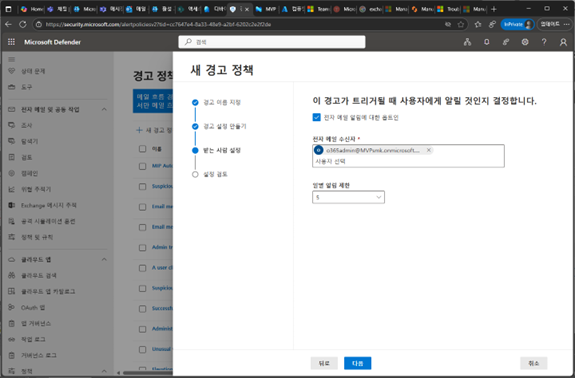
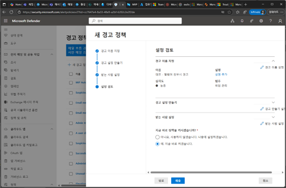
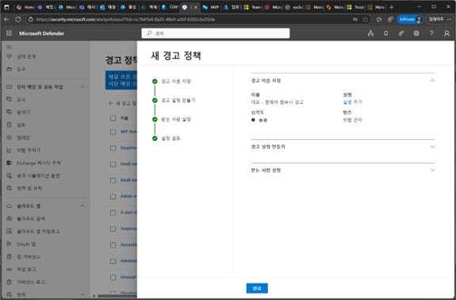

# 작업 7. 경고 정책 설정
1.	Microsoft Defender 포탈에서 [전자 메일 및 공동작업] –[경고 정책]을 클릭합니다. 
 

2.	경고 정책 화면에서 [새 경고 정책]을 클릭합니다. 
 

3.	새 경고 정책을 생성하는 단계에서 [이름], [설명], [심각도], [범주]등을 설정합니다. 
 

4.	경고 설정 만들기에서 활동에 대한 조건을 추가하여 경고에 대한 부분을 생성할 수 있습니다. 메일 전송, 메일 전송 방향, 우선순위등을 세부 설정이 가능합니다. 
 

5.	받는 사람 설정 단계에서 이 경고가 트리거될 때 사용자에게 알릴 것인지 설정합니다. 
 

6.	설정 검토 단계에서 경고 정책 설정 부분을 검토하고, 정책 적용 여부를 선택 후 [제출]을 클릭합니다. 
 

7.	정책이 제출되면 새로운 경고 알림 정책이 생성됩니다. 
 

