# 작업 8. 메일 공격 시뮬레이션 훈련
#### 일반적인 공격을 방지하기 위해 사용자 지정 정책을 정의하는 것 외에도 또 다른 강력한 기술은 공격자가 악용하려는 일반적인 실수를 방지하는 방법을 배우도록 사용자를 교육하는 것입니다. Office 365용 Microsoft Defender는 공격 시뮬레이션 교육을 통해 정책을 테스트하고 최종 사용자에게 공격에 대해 교육하는 유용한 도구를 제공합니다. 공격 시뮬레이션 교육은 실제 공격이 발생하기 전에 조직의 취약한 사용자를 안전하게 식별하는 데 사용할 수 있습니다.

1.	Microsoft Defender 포탈에서 [전자 메일 및 공동작업] – [공격 시뮬레이션 훈련]을 클릭하면 나타나는 화면에서 [시뮬레이션]탭에서 [+시뮬레이션 시작]을 클릭합니다. 
 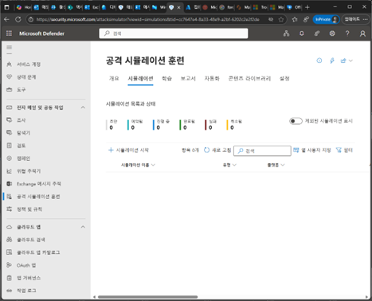

2.	기술 선택 단계에서 나열된 시뮬레이션 중에서 하나를 선택한 후 [다음]을 클릭합니다. 여기서는 [자격 증명 수집]을 선택하였습니다.  
 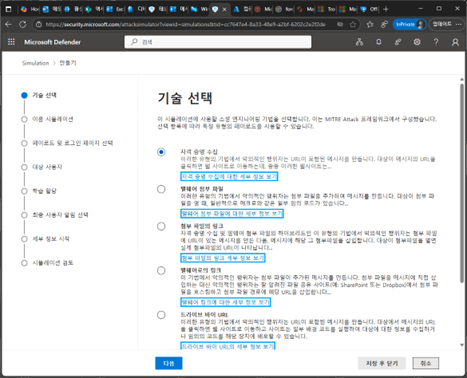

3.	이름 시뮬레이션 단계에서는 [시뮬레이션 이름], [설명]을 입력한 후 [다음]을 클릭합니다. 
 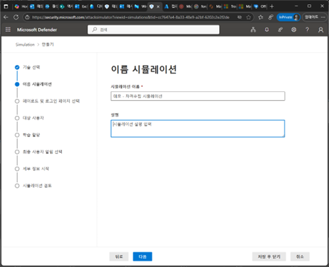

4.	페이로드 및 로그인 페이지 선택 단계에서는 Microsoft에서 제공하는 시뮬레이션 기법의 페이로드를 선택할 수 있고, 또는 직접 페이로드를 만들어 추가할 수 도 있습니다. 페이로드를 선택한 후 [다음]을 클릭합니다. 
 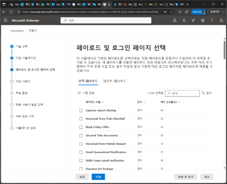

5.	대상 사용자 단계에서는 시뮬레이션의 대상자를 선택합니다. 설정 후 [다음]을 클릭합니다. 
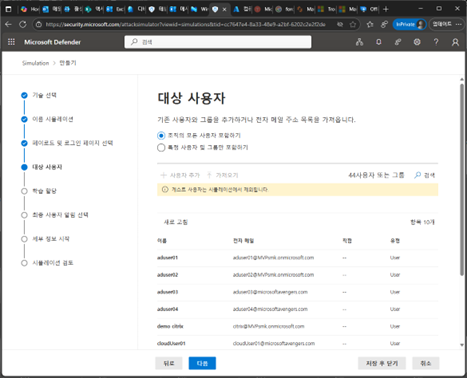
 

6.	사용자 제외 단계에서는 위에서 포함된 전체사용자 또는 그룹에서 특정 사용자를 제외 설정이 가능합니다. 설정 후 [다음]을 클릭합니다. 
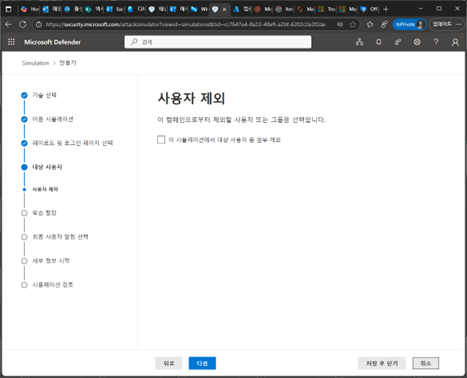
 

7.	학습 할당 단계에서는 관련 시뮬레이션이 진행되어 공격을 당한 사용자에게 교육 컨텐츠를 할당하게 됩니다. 교육 과정을 선택하고, 기한도 설정하여 교육을 마무리할 수 있도록 제한할 수 있습니다. 설정 후 [다음]을 클릭합니다. 
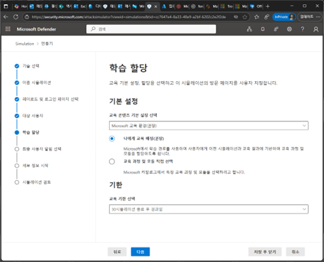
 

8.	피싱 방문 페이지 선택 단계에서는 피싱을 받은 후 사용자에게 학습을 제공할 방문 페이지를 선택합니다. 기본적으로 제공하는 방문 페이지를 설정할 수 도 있고, 임의적인 URL을 통하여 방문 페이지 설정이 가능합니다. 레이아웃 편집 메뉴에서는 회사 및 관련 로고 이미지를 추가하고, 기본 언어를 설정 후 [다음]을 클릭합니다. 
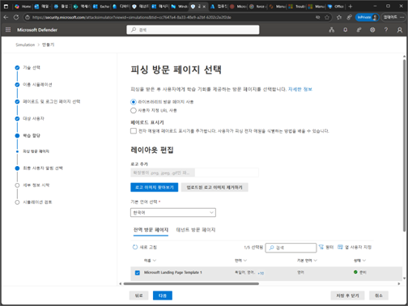

 

9.	최종 사용자 알림 선택 단계에서는 이 시뮬레이션 캠페인에 대한 최종 사용자 알림을 설정할 수 있습니다. 설정 후 [다음]을 클릭합니다. 
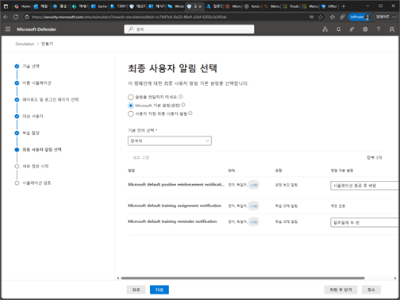
 

10.	세부 정보 시작 단계에서는 이 시뮬레이션을 시작하는 날짜 및 기간에 대한 설정을 가능합니다. 설정 후 [다음]을 클릭합니다. 
 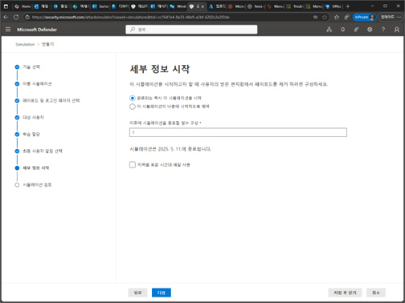

11.	시뮬레이션 검토 단계에서 상단 메뉴의 [시험 전송]을 클릭합니다. 
 

12.	테스트 전자 메일 보내기 팝업 창이 나타나고, [확인]을 클릭하면 현재 로그인한 사용자에게 이 페이로드가 전송되어 포맷 유효성 검사를 수행할 수 있습니다.  
 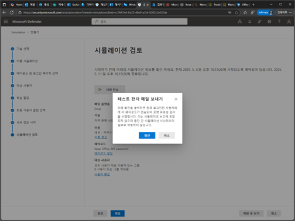

13.	시뮬레이션 검토 단계에서 앞에서 설정된 모든 부분을 확인하고 검토한 후 [제출]을 클릭합니다. 
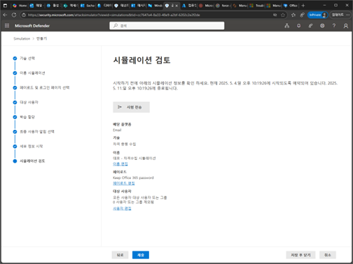
 

14.	시뮬레이션이 설정된 값 대로 실행되도록 설정이 완료된 메시지를 확인 후 [완료]를 클릭합니다. 지정된 일자와 기간대로 대상이 된 사용자에게 시뮬레이션이 진행됩니다. 
 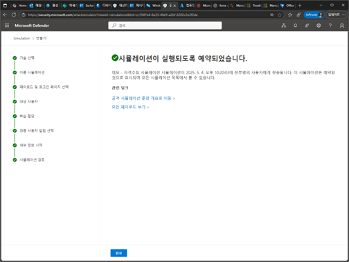

15.	공격 시뮬레이션 훈련 화면의 [시뮬레이션]탭에 추가한 시뮬레이션 목록이 나열되며, 관련된 시작과 종료 날짜등을 확인할 수 있습니다.  
 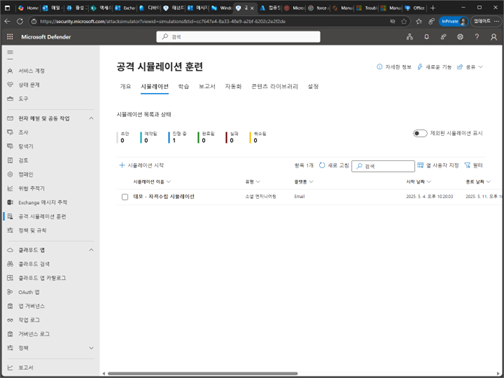

16.	(관리자계정이 아닌 일반 사용자 계정으로 로그인합니다.)
대상이 된 사용자에게 다음과 같이 시뮬레이션 메일이 전송됩니다. 전송된 메일을 실행하지 않거나 제거하는 경우라면 시뮬레이션 공격이 실패되는 것이지만, 테스트를 위하여 이 메일의 [Keep Current Password] 링크를 클릭합니다. 
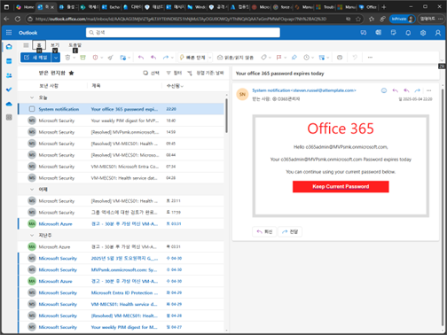
 

17.	로그인을 위한 ID 입력창이 나타납니다. ID를 입력하여 접속을 시도합니다. 
 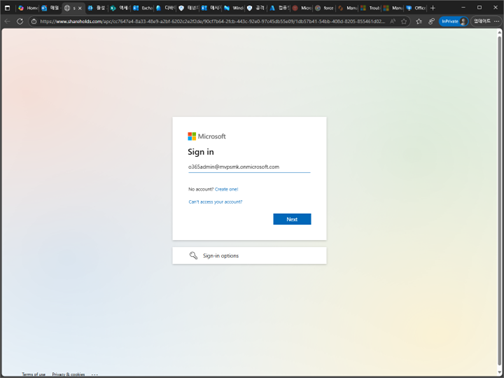

18.	다음과 같이 피싱 시뮬레이션에 당한 부분의 알림 페이지가 나타납니다.  
 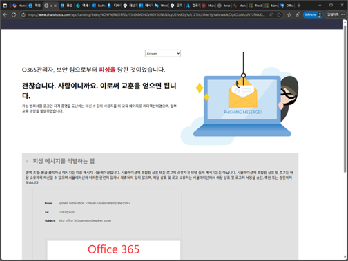

19.	공격 시뮬레이션으로 당한 사용자는 다음과 교육 메일이 전송됩니다.  
 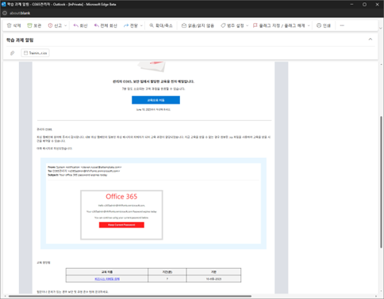

20.	관련 훈련 과제에게 대해서 학습의 진도를 확인하 수 있습니다.  
 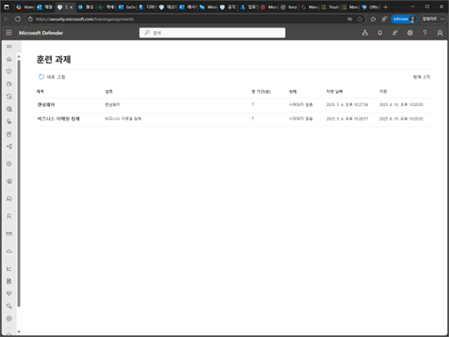

21.	관련 학습 웹 페이지를 통하여 공격 시나리오별로 학습을 진행하게 됩니다.  
 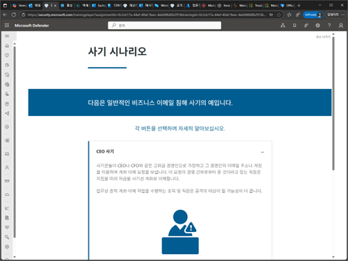

22.	(관리자 계정으로 로그인합니다.)
공격 시뮬레이션 훈련 화면에서 [시뮬레이션] 탭에서 나열된 공격 시나리오를 클릭합니다. 여기서는 (데모-자격수집 시뮬레이션)을 클릭합니다. 
 

23.	해당되는 시뮬레이션에 대한 보고, 사용자, 세부 정보에 대한 부분의 통계자료를 확인할 수 있습니다. [보고]탭에서는 대상이 된 사용자의 손상된 비율, 사용자의 활동, 시뮬레이션 메일 배달 상태, 교육진행된 상태를 한곳에 확인이 가능하게 됩니다. 
 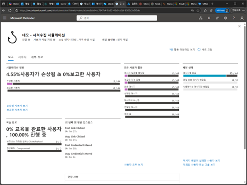

24.	시뮬레이션 대시보드 화면에서 [사용자]탭을 선택하면, 시뮬레이션으로 손상된 사용자와 상태등을 확인할 수 있습니다.  
 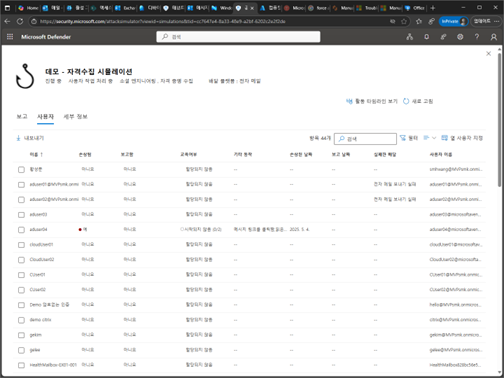
